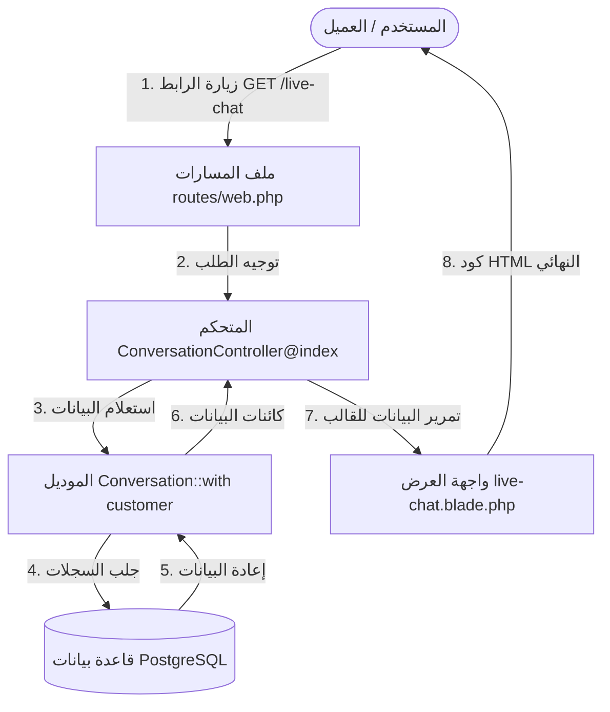
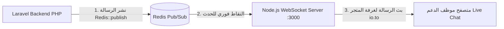
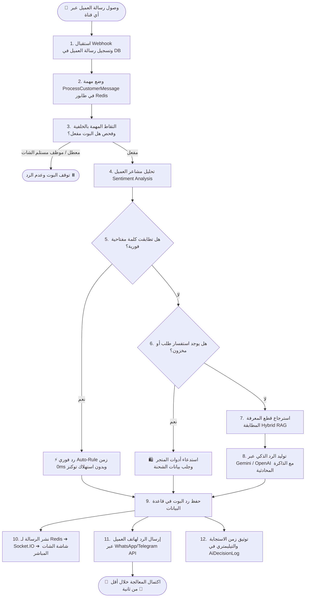

<div dir="rtl">

# 🎓 الموسوعة التعليمية الشاملة لطلاب البرمجة وهندسة البرمجيات — مشروع منصة ردود (Rudood Platform)
# The Ultimate Software Engineering & Computer Science Student Master Guide

> **إعداد:** الفريق الهندسي المتقدم وإدارة المعمارية التقنية للمنصة  
> **الفئة المستهدفة:** طلاب كليات علوم الحاسب، هندسة البرمجيات، ومطورو الويب المبتدئون (Junior Developers)  
> **الهدف:** الانتقال من فهم المفاهيم النظرية المجردة إلى فهم وتطبيق أنظمة الشركات الحقيقية (Enterprise Systems) المتكاملة مع قواعد البيانات، الطوابير غير المتزامنة، الذكاء الاصطناعي، والاتصال اللحظي.

---

## 📑 الفهرس التفصيلي للموسوعة التعليمية (Detailed Table of Contents)

1. [🌟 1. مدخل تمهيدي: ما هي منصة ردود؟ وكيف تفكر كمهندس برمجيات؟](#1-مدخل-تمهيدي-ما-هي-منصة-ردود-وكيف-تفكر-كمهندس-برمجيات)
2. [📁 2. جولة استكشافية في هيكل المشروع ومجلدات Laravel (The Folder Tour)](#2-جولة-استكشافية-في-هيكل-المشروع-ومجلدات-laravel-the-folder-tour)
3. [🧱 3. المفاهيم الهندسية والبرمجية الأساسية مشروحة من الصفر (Core CS Concepts)](#3-المفاهيم-الهندسية-والبرمجية-الأساسية-مشروحة-من-الصفر-core-cs-concepts)
   - [3.1 البرمجة كائنية التوجه (OOP) في العالم الحقيقي](#31-البرمجة-كائنية-التوجه-oop-في-العالم-الحقيقي)
   - [3.2 نمط التصميم MVC (Model - View - Controller)](#32-نمط-التصميم-mvc-model---view---controller)
   - [3.3 دورة حياة الطلب في Laravel (HTTP Request Lifecycle)](#33-دورة-حياة-الطلب-في-laravel-http-request-lifecycle)
   - [3.4 قواعد البيانات، الـ ORM والعلاقات (Eloquent Relationships & Indexes)](#34-قواعد-البيانات-الـ-orm-والعلاقات-eloquent-relationships--indexes)
   - [3.5 الطوابير غير المتزامنة (Queues) ووسيط Redis](#35-الطوابير-غير-المتزامنة-queues-ووسيط-redis)
   - [3.6 البث اللحظي عبر WebSockets و Node.js](#36-البث-اللحظي-عبر-websockets-و-nodejs)
   - [3.7 الذكاء الاصطناعي، المتجهات والـ RAG والرياضيات وراءها (Vector Embeddings & Cosine Math)](#37-الذكاء-الاصطناعي-المتجهات-والـ-rag-والرياضيات-وراءها)
   - [3.8 تعدد المستأجرين (Multi-Tenancy) وعزل بيانات الشركات](#38-تعدد-المستأجرين-multi-tenancy-وعزل-بيانات-الشركات)
   - [3.9 الحماية والأمان (Security, CSRF, CSP, SQL Injection & Rate Limiting)](#39-الحماية-والأمان-security-csrf-csp-sql-injection--rate-limiting)
4. [🗺️ 4. رحلة الرسالة: ماذا يحدث في أجزاء من الثانية خلف الكواليس؟](#4-رحلة-الرسالة-ماذا-يحدث-في-أجزاء-من-الثانية-خلف-الكواليس)
5. [🔍 5. تفكيك وتحليل 10 ميزات وأنظمة واقعية في الكود سطراً بسطر (10 Real-World Systems)](#5-تفكيك-وتحليل-10-ميزات-وأنظمة-واقعية-في-الكود-سطرا-بسطر)
   - [5.1 التسجيل الذري للمتجر والمستخدم والبوت (`AuthController::register`)](#51-التسجيل-الذري-للمتجر-والمستخدم-والبوت)
   - [5.2 استقبال رسائل واتساب والتحقق من التوقيع (`WebhookController`)](#52-استقبال-رسائل-واتساب-والتحقق-من-التوقيع)
   - [5.3 استماع تيليجرام التزامني عبر ديمون الكونسول (`TelegramPollCommand`)](#53-استماع-تيليجرام-التزامني-عبر-ديمون-الكونسول)
   - [5.4 محرك القرار الذكي رباعي المستويات (`ProcessCustomerMessage`)](#54-محرك-القرار-الذكي-رباعي-المستويات)
   - [5.5 البحث الدلالي بالمتجهات وتقطيع المستندات (`RagService`)](#55-البحث-الدلالي-بالمتجهات-وتقطيع-المستندات)
   - [5.6 التدخل البشري وإيقاف البوت في الشات الحي (`ConversationController::toggleBot`)](#56-التدخل-البشري-وإيقاف-البوت-في-الشات-الحي)
   - [5.7 تشييد رسائل واتساب التفاعلية وكروت الكتالوج (`WhatsAppInteractiveService`)](#57-تشييد-رسائل-واتساب-التفاعلية-وكروت-الكتالوج)
   - [5.8 أدوات التجارة الإلكترونية وتتبع الشحنات (`StoreIntegrationService`)](#58-أدوات-التجارة-الإلكترونية-وتتبع-الشحنات)
   - [5.9 تتبع التحويلات وحساب العائد المالي والـ ROI (`ConversionTrackingService`)](#59-تتبع-التحويلات-وحساب-العائد-المالي-والـ-roi)
   - [5.10 انتحال جلسة المتجر وسجل التدقيق الأمني (`Impersonation & AuditLog`)](#510-انتحال-جلسة-المتجر-وسجل-التدقيق-الأمني)
6. [🛠️ 6. مسار التطبيق العملي: 10 تمارين برمجية مع الحلول الكاملة (10 Student Challenges)](#6-مسار-التطبيق-العملي-10-تمارين-برمجية-مع-الحلول-الكاملة)
7. [🐞 7. دليل اكتشاف الأخطاء وتصحيحها للمبتدئين (Debugging & Troubleshooting Guide)](#7-دليل-اكتشاف-الأخطاء-وتصحيحها-للمبتدئين-debugging--troubleshooting-guide)
8. [🚀 8. خطوات تثبيت وتشغيل المشروع محلياً من الصفر (Setup Guide)](#8-خطوات-تثبيت-وتشغيل-المشروع-محليا-من-الصفر-setup-guide)
9. [📖 9. قاموس المصطلحات البرمجية الشامل (Comprehensive Glossary)](#9-قاموس-المصطلحات-البرمجية-الشامل-comprehensive-glossary)

---

# 1. 🌟 مدخل تمهيدي: ما هي منصة ردود؟ وكيف تفكر كمهندس برمجيات؟

## أ) القصة والمشكلة الحقيقية:
تخيّل أنك مالك متجر إلكتروني يبيع منتجات ذكية وعطوراً، ولديك **10,000 عميل** يراسلونك يومياً عبر:
- تطبيق **WhatsApp**.
- بوت **Telegram**.
- رسائل وتعليقات **Instagram**.
- ودجت الدردشة المباشرة على متجرك الإلكتروني.

أكثر من **85%** من هذه الرسائل تدور حول أسئلة مكررة:
1. *"أين طلبي رقم 1002؟"*
2. *"كم سعر الشحن لجدة؟ وما هي مدة التوصيل؟"*
3. *"هل سماعات النخبة Pro مقاومة للماء؟"*
4. *"أريد استبدال منتج وصلني."*

### ما المشكلة في الحل التقليدي؟
لو وظفت 10 موظفي خدمة عملاء:
- ستدفع رواتب شهرية تفوق 40,000 ريال.
- الموظفون يتأخرون في الرد بالدقائق والساعات.
- في الليل وأيام العطلات يتوقف الرد تماماً وتضيع المبيعات.
- قد يخطئ الموظف في إعطاء معلومة غير صحيحة عن سياسة الاسترجاع.

### الحل الهندسي (منصة ردود):
قمنا ببناء منصة سحابية مؤتمتة تعمل كـ **"عقل ذكي وموظف فائق السرعة"** يقوم بما يلي:
1. **الرد خلال أقل من 1.2 ثانية** فور وصول الرسالة.
2. **فهم اللهجات العربية المختلفة** (سعودي، مصري، كويتي، مغربي، شامي) إلى جانب الفصحى والإنجليزية.
3. **قراءة كتيبات المتجر (ملفات PDF/Word)** وتوليد إجابات دقيقة موثوقة 100% دون أي هلوسة (RAG).
4. **الاتصال بقاعدة بيانات الطلبات** لاستخراج مسار الشحنات ورقم البوليصة وموعد الوصول.
5. **التعرف على العميل الغاضب فوراً** والتنبيه عليه وتصعيد المحادثة لموظف بشري مع جرس إنذار أحمر.
6. **حساب المبيعات المتحققة** وساعات العمل التي وفرها البوت للمتجر شهرياً بالريال السعودي.

---

## ب) كيف يفكر مهندس البرمجيات عند بناء هذا المشروع؟
عندما يُطلب منك بناء نظام ضخم كهذا، لا تبدأ بكتابة الكود فوراً! بل تقسم المشكلة إلى طبقات (Layers):
1. **طبقة الاستقبال (Ingestion Layer):** كيف نستقبل الرسائل من واتساب وتيليجرام وإنستغرام والويب؟ ➔ الحل: **Webhooks & APIs**.
2. **طبقة الطوابير (Queue Layer):** كيف نمنع بطء أو تعليق الخادم أثناء تفكير الذكاء الاصطناعي؟ ➔ الحل: **Redis & Background Jobs**.
3. **طبقة المعالجة والذكاء (AI Engine Layer):** كيف يقرر النظام الإجابة الصحيحة بأقل تكلفة وسرعة فائقة؟ ➔ الحل: **Multi-Tier Pipeline & Hybrid RAG**.
4. **طبقة البيانات (Persistence Layer):** أين نخزن الرسائل والمتاجر والعملاء والمتجهات؟ ➔ الحل: **PostgreSQL 16 + pgvector**.
5. **طبقة البث اللحظي (Real-Time Broadcast Layer):** كيف يرى موظف الدعم الرسائل فوراً على شاشته دون تحديث الصفحة؟ ➔ الحل: **Node.js + Socket.IO**.

---

# 2. 📁 2. جولة استكشافية في هيكل المشروع ومجلدات Laravel (The Folder Tour)

عندما تفتح مجلد `backend/` في المشروع، ستجد بنية منظمة وموحدة عالمياً. إليك وظيفة كل مجلد:

```
rudood-platform/
├── backend/                     # تطبيق Laravel الأساسي
│   ├── app/                     # قلب المنطق البرمجي (Core Business Logic)
│   │   ├── Console/Commands/    # أوامر موجه الأوامر المخصصة (مثل ديمون تيليجرام)
│   │   ├── Http/
│   │   │   ├── Controllers/     # المتحكمات التي تستقبل الطلبات وتعيد الردود
│   │   │   │   └── Admin/       # متحكمات لوحة الإدارة العليا (Super Admin)
│   │   │   └── Middleware/      # حراس الأمان والتحقق من الصلاحيات ووضع الصيانة
│   │   ├── Jobs/                # الوظائف الخلفية غير المتزامنة (مثل ProcessCustomerMessage)
│   │   ├── Models/              # نماذج البيانات والعلاقات مع جداول PostgreSQL (19 Model)
│   │   ├── Providers/           # مزودات الخدمات وتهيئة إطار العمل
│   │   └── Services/            # كلاسات الخدمات والعمليات الذكية والرياضية (AI & RAG)
│   ├── bootstrap/               # إقلاع وتشغيل التطبيق (bootstrap/app.php)
│   ├── config/                  # ملفات الإعدادات (قواعد البيانات، الطوابير، الكاش، الجلسات)
│   ├── database/
│   │   ├── migrations/          # نصوص إنشاء وتعديل جداول قاعدة البيانات برمجياً
│   │   └── seeders/             # نصوص تعبئة البيانات التجريبية والحسابات الأولية
│   ├── public/                  # الملفات العامة (index.php, CSS, JS, widget.js, الصور)
│   ├── resources/
│   │   └── views/               # قوالب واجهات المستخدم المبنية بـ Blade و Bootstrap
│   ├── routes/
│   │   ├── web.php              # مسارات واجهات الويب ولوحات التحكم
│   │   ├── api.php              # مسارات الـ Webhooks والـ Widget وفحص الصحة
│   │   └── console.php          # مسارات أوامر الكونسول والجدولة
│   ├── storage/                 # الملفات المرفوعة، ملفات الكاش، وسجلات الأخطاء (logs)
│   ├── tests/                   # حزم الاختبارات الآلية (Unit & Feature Tests)
│   ├── websocket/               # خادم الويب سوكت المستقل (Node.js + Socket.IO)
│   │   └── server.js            # كود استقبال رسائل Redis وبثها للمتصفحات
│   ├── Dockerfile               # تعليمات بناء حاوية الـ PHP-FPM و Nginx
│   └── tests_suite_runner.php   # مشغل الاختبارات الشامل المخصص (102 اختبار)
├── Caddyfile                    # خادم الويب المتقدم والبروكسي العكسي وإدارة الـ SSL
├── docker-compose.yml           # ملف تشغيل الحاويات الخمسة معاً بضغطة زر
└── README.md                    # التوثيق والتعريف بالمنصة
```

---

# 3. 🧱 3. المفاهيم الهندسية والبرمجية الأساسية مشروحة من الصفر (Core CS Concepts)

## 3.1 البرمجة كائنية التوجه (OOP) في العالم الحقيقي

البرمجة كائنية التوجه ليست مجرد نظريات للامتحانات، بل هي العمود الفقري لهذا المشروع:

1. **التغليف (Encapsulation):**
   حماية المتغيرات داخل الكلاس وتوفير دوال للتحكم بها.
   * *مثال في ردود:* في [`AiService.php`](./backend/app/Services/AiService.php)، المتغير `$overrides` والمتغير `$lastError` معرفان كـ `private`، ولا يمكن قراءتهما أو تعديلهما من الخارج إلا عبر دوال مخصصة مثل `getLastError()` و `setOverrides()`.

2. **الوراثة (Inheritance):**
   * *مثال في ردود:* كل نموذج (مثل `Workspace` و `Bot` و `Message`) يرث من كلاس `Illuminate\Database\Eloquent\Model`، مما يعطيه تلقائياً القدرة على تنفيذ استعلامات مثل `Workspace::find(1)` و `Bot::where(...)`.
   * كلاس [`ProcessCustomerMessage`](./backend/app/Jobs/ProcessCustomerMessage.php) يرث خصائص الطوابير عبر الـ Traits: `Queueable`, `InteractsWithQueue`, `SerializesModels`.

3. **تعدد الأشكال ونمط الاستراتيجية (Polymorphism & Strategy Pattern):**
   * في [`AiService`](./backend/app/Services/AiService.php)، نستخدم واجهة موحدة `generateReply()` بغض النظر عما إذا كان المزود هو Gemini أو OpenAI أو Claude. الكود يختار الخوارزمية المناسبة أثناء التشغيل ديناميكياً.

---

## 3.2 نمط التصميم MVC (Model - View - Controller)

</div>



<div dir="rtl">

---

## 3.3 دورة حياة الطلب في Laravel (HTTP Request Lifecycle)

ماذا يحدث بالتحديد من لحظة طلب صفحة حتى ظهورها على شاشة المستخدم؟

1. يدخل الطلب عبر خادم الويب (Nginx / Caddy) ويصل إلى الملف العام الوحيد: `public/index.php`.
2. يتم تشغيل نواة إطار العمل (Kernel Bootstrap) وتحميل الـ Service Providers والإعدادات.
3. يمر الطلب بسلسلة **البرمجيات الوسيطة (Middleware Pipeline)** للتأكد من:
   - هل التطبيق في وضع الصيانة؟ (`CheckMaintenanceMode`).
   - هل المستخدم مسجل دخوله؟ (`auth`).
   - هل حساب الشركة نشط ولديه رصيد؟ (`EnsureWorkspaceIsActive`).
   - حماية رؤوس الأمان (`ContentSecurityPolicy`).
4. يبحث نظام التوجيه (**Routing Engine**) في `routes/web.php` أو `routes/api.php` عن الدالة المناسبة.
5. ينفذ الـ **Controller** العمليات المطلوبة، ويستدعي الـ **Services** والـ **Models**.
6. يتم توليد الاستجابة (**HTTP Response**) إما كـ HTML View أو JSON وإرجاعها للمتصفح.

---

## 3.4 قواعد البيانات، الـ ORM والعلاقات (Eloquent Relationships & Indexes)

في المشاريع الكبرى، لا نكتب استعلامات SQL نصية متناثرة، بل نستخدم **Eloquent ORM** (Object-Relational Mapping):

### أنواع العلاقات المطبقة في المنصة:
1. **علاقة واحد لمتعدد (One-to-Many):**
   - المتجر الواحد لديه عدة محادثات:
</div>

```php
// في موديل Workspace.php
public function conversations(): HasMany
{
    return $this->hasMany(Conversation::class);
}
```

<div dir="rtl">

   - المحادثة الواحدة تنتمي لمتجر محدد:
</div>

```php
// في موديل Conversation.php
public function workspace(): BelongsTo
{
    return $this->belongsTo(Workspace::class);
}
```

<div dir="rtl">

2. **علاقة واحد لواحد (One-to-One):**
   - المتجر له بوت افتراضي نشط واحد:
</div>

```php
// في موديل Workspace.php
public function defaultBot(): HasOne
{
    return $this->hasOne(Bot::class)->where('is_active', true);
}
```

<div dir="rtl">

### حل مشكلة N+1 Query عبر Eager Loading:
إذا أردنا عرض 50 محادثة مع أسماء عملائها:
- **الطريقة الخاطئة:** جلب الـ 50 محادثة، ثم في حلقة تكرار استعلام اسم العميل لكل محادثة (ينتج عنها 51 استعلام لقاعدة البيانات ويصبح الموقع بطيئاً جداً!).
- **الحل الذكي في ردود (Eager Loading):** نستخدم `with('customer')`، فيقوم Laravel بجلب كل المحادثات والعملاء في استعلامين سريعين فقط:
</div>

```php
$conversations = Conversation::with('customer', 'workspace')
    ->where('workspace_id', $workspaceId)
    ->latest('last_message_at')
    ->get();
```

<div dir="rtl">

---

## 3.5 الطوابير غير المتزامنة (Queues) ووسيط Redis

لماذا نحتاج الـ Queues في تطبيقات الذكاء الاصطناعي؟
- الاتصال بنماذج الذكاء الاصطناعي (مثل Gemini أو OpenAI) قد يستغرق **1.5 إلى 3 ثوانٍ**.
- إذا جعلنا المستخدم ينتظر في المتصفح أثناء هذا الاتصال، ستتجمد الصفحة، وإذا أرسلت Meta رسالة Webhook ستعتبر الخادم معطلاً إذا لم يرد خلال ثانيتين.
- **الحل:** نضع المهمة في طابور **Redis** في ذاكرة الرام خلال **0.005 ثانية**، ونرد على Meta فوراً.
- يقوم كلاس [`ProcessCustomerMessage`](./backend/app/Jobs/ProcessCustomerMessage.php) بتنفيذ الاتصال بالذكاء الاصطناعي في الخلفية دون أي تعطيل للموقع.

---

## 3.6 البث اللحظي عبر WebSockets و Node.js

</div>



<div dir="rtl">

عند حفظ رد البوت في قاعدة البيانات، ينفذ Laravel السطر التالي:
</div>

```php
Redis::publish('rudood_chat_channel', json_encode([
    'conversation_id' => $conversation->id,
    'workspace_id'    => $conversation->workspace_id,
    'sender_type'     => 'bot',
    'content'         => $botMessage->content,
    'time'            => $botMessage->created_at->format('H:i'),
]));
```

<div dir="rtl">

ويقوم خادم Node.js في `backend/websocket/server.js` باستلامه فوراً وإرساله للمتصفح عبر Socket.IO.

---

## 3.7 الذكاء الاصطناعي، المتجهات والـ RAG والرياضيات وراءها

### ما هو الـ Vector Embedding رياضياً؟
هو تحويل النص اللغوي إلى مصفوفة أرقام عشرية تمثل إحداثيات موقع الجملة في "فضاء المعاني" (Semantic Space):
- الجملتان: *"كم سعر التوصيل؟"* و *"ما هي تكلفة الشحن؟"* تختلفان تماماً في الحروف، لكن لهما نفس المتجه الرياضي تقريباً!

### حساب تشابه جيب التمام (Cosine Similarity Formula):
لقياس مدى تطابق سؤال العميل مع قطعة في مستند المتجر، نستخدم قانون الزاوية بين متجهين:

$$\text{Cosine Similarity}(\vec{A}, \vec{B}) = \frac{\sum_{i=1}^{n} A_i B_i}{\sqrt{\sum_{i=1}^{n} A_i^2} \sqrt{\sum_{i=1}^{n} B_i^2}}$$

- إذا كانت النتيجة **1.0** فهذا يعني تطابقاً دلالياً تاماً.
- إذا كانت النتيجة **0.0** فلا توجد أي علاقة بين الجملتين.

---

## 3.8 تعدد المستأجرين (Multi-Tenancy) وعزل بيانات الشركات

في منصة ردود، يتم تطبيق مفهوم **Shared Database, Shared Schema with Tenant Scoping**:
- جميع المتاجر تستخدم نفس الجداول، ولكن كل صف يحتوي على `workspace_id`.
- كل عملية جلب أو تعديل تتأكد برمجياً من رقم الشركة الحالي:
</div>

```php
$user = auth()->user();
$workspaceId = $user->workspace_id;

// استعلام معزول ومحمي 100%
$bots = Bot::where('workspace_id', $workspaceId)->get();
```

<div dir="rtl">

---

## 3.9 الحماية والأمان (Security, CSRF, CSP, SQL Injection & Rate Limiting)

1. **الحماية من هجمات XSS وحقن النصوص الخبيثة:**
   - تطبيق وسيط `ContentSecurityPolicy` الذي يقيد مصادر تشغيل الجافاسكريبت.
   - استخدام محرك Blade الذي يقوم بتطهير المتغيرات تلقائياً عبر `{{ $message }}` (Htmlspecialchars).
2. **الحماية من هجمات SQL Injection:**
   - استخدام Eloquent ORM و PDO Prepared Statements، حيث يتم إرسال القيم كـ Parameters مفصولة عن هيكل استعلام الـ SQL.
3. **الحماية من هجمات التخمين (Rate Limiting):**
   - مسار تسجيل الدخول محمي بـ `throttle:login` (5 محاولات في الدقيقة فقط).
   - مسارات الـ Webhooks محمية بـ `throttle:webhook` (60 طلباً في الدقيقة لمنع إغراق الخادم هجمات DDoS).

---

# 4. 🗺️ 4. رحلة الرسالة: ماذا يحدث في أجزاء من الثانية خلف الكواليس؟

</div>



<div dir="rtl">

---

# 5. 🔍 5. تفكيك وتحليل 10 ميزات وأنظمة واقعية في الكود سطراً بسطر

## 5.1 التسجيل الذري للمتجر والمستخدم والبوت
في ملف [`AuthController.php`](./backend/app/Http/Controllers/AuthController.php):
- نستخدم `DB::transaction` لضمان أنه إذا فشل إنشاء أي جزء (مثلاً فشل إنشاء البوت)، يتم التراجع عن إنشاء المتجر والمستخدم تلقائياً (All or Nothing) لمنع وجود بيانات يتيمة مشوهة.

## 5.2 استقبال رسائل واتساب والتحقق من التوقيع
في ملف [`WebhookController.php`](./backend/app/Http/Controllers/WebhookController.php):
- التحقق من `hub.verify_token` الذي ترسله Meta للتأكد من هوية المرسل.
- استخراج رقم المرسل ونص الرسالة ونوعها (نص عادي أو ضغطة زر تفاعلي).

## 5.3 استماع تيليجرام التزامني عبر ديمون الكونسول
في ملف [`TelegramPollCommand.php`](./backend/app/Console/Commands/TelegramPollCommand.php):
- تشغيل حلقة تكرارية مستمرة `while (true)` تستعلم عن التحديثات عبر دالة `getUpdates` مع استخدام بارامتر `offset` لتأكيد استلام الرسائل السابقة وعدم تكرارها.

## 5.4 محرك القرار الذكي رباعي المستويات
في ملف [`ProcessCustomerMessage.php`](./backend/app/Jobs/ProcessCustomerMessage.php):
- يطبق مبدأ التوفير والسرعة: (1. قواعد فورية مجانية ➔ 2. أدوات حية ➔ 3. RAG مستندي ➔ 4. LLM ذكي).

## 5.5 البحث الدلالي بالمتجهات وتقطيع المستندات
في ملف [`RagService.php`](./backend/app/Services/RagService.php):
- حساب الـ Cosine Similarity ودمج درجات البحث الدلالي مع مطابقة الكلمات المفتاحية (60% Vector + 40% Keyword).

## 5.6 التدخل البشري وإيقاف البوت في الشات الحي
في ملف [`ConversationController.php`](./backend/app/Http/Controllers/ConversationController.php):
- تعديل حقل `is_bot_paused = true` لمنع البوت من مقاطعة حديث الموظف البشري مع العميل.

## 5.7 تشييد رسائل واتساب التفاعلية وكروت الكتالوج
في ملف [`WhatsAppInteractiveService.php`](./backend/app/Services/WhatsAppInteractiveService.php):
- بناء هياكل JSON المعقدة لأزرار الرد السريع وقوائم الأقسام المتوافقة مع Meta Graph API v19.0.

## 5.8 أدوات التجارة الإلكترونية وتتبع الشحنات
في ملف [`StoreIntegrationService.php`](./backend/app/Services/StoreIntegrationService.php):
- تنظيف أرقام الشحنات والبحث في جدول `mock_orders` وإرجاع تفاصيل شركة الشحن والمسار.

## 5.9 تتبع التحويلات وحساب العائد المالي والـ ROI
في ملف [`ConversionTrackingService.php`](./backend/app/Services/ConversionTrackingService.php):
- ربط عمليات الشراء التي تمت خلال **72 ساعة** بمحادثة البوت، وحساب ساعات العمل الموفرة (0.17 ساعة لكل محادثة) ومعدل التوفير بالريال.

## 5.10 انتحال جلسة المتجر وسجل التدقيق الأمني
في ملف [`AdminWorkspaceController.php`](./backend/app/Http/Controllers/Admin/AdminWorkspaceController.php):
- تخزين معرف الـ Super Admin في `session('impersonated_by')` والدخول كمالك المتجر لمعاينة مشكلته وحلها بضغطة زر واحدة.

---

# 6. 🛠️ 6. مسار التطبيق العملي: 10 تمارين برمجية مع الحلول الكاملة (10 Student Challenges)

إليك 10 تحديات برمجية متدرجة من البسيط إلى المتقدم لتتدرب عليها بيدك في الكود:

---

### 🔹 التمرين 1: إضافة فاحص كود الخصم (Coupon Validator Tool)
**المطلوب:** في ملف `StoreIntegrationService.php`، أضف دالة تقبل كود الخصم وتتأكد هل هو صالح أم لا:
</div>

```php
public function checkCoupon(string $code): array
{
    $coupons = [
        'START2026' => ['discount' => '20%', 'min' => 150],
        'FREE_SHIP' => ['discount' => 'شحن مجاني', 'min' => 200],
    ];
    $clean = strtoupper(trim($code));
    if (isset($coupons[$clean])) {
        return ['valid' => true, 'desc' => "كود فعال يمنحك {$coupons[$clean]['discount']}"];
    }
    return ['valid' => false, 'desc' => 'كود غير صالح'];
}
```

<div dir="rtl">

---

### 🔹 التمرين 2: إضافة قاعدة رد فوري لساعات العمل
**المطلوب:** في لوحة تحكم المتجر `/ai-manage`، أضف قاعدة رد فوري:
- **الكلمات المفتاحية:** `أوقات العمل, ساعات العمل, متى تفتحون, الدوام`.
- **نص الرد:** *"أهلاً بك! نسعد بخدمتكم يومياً من السبت إلى الخميس من 9 صباحاً حتى 10 مساءً، والجمعة من 2 ظهراً حتى 10 مساءً."*

---

### 🔹 التمرين 3: إضافة فحص لكلمات الغضب الشديد
**المطلوب:** في ملف `AiService.php` داخل مصفوفة `$angryKeywords`، أضف كلمات إضافية مثل `'غش', 'خداع', 'بلاغ'`.

---

### 🔹 التمرين 4: إنشاء اختصار رد سريع جديد (Slash Canned Reply)
**المطلوب:** في ملف `ConversationController.php` أو من شاشة الشات المباشر، أنشئ اختصار `/return` ليرسل سياسة الاستبدال خلال 14 يوماً.

---

### 🔹 التمرين 5: إضافة مؤشر جديد في لوحة تحكم التاجر
**المطلوب:** في ملف `DashboardController.php`، احسب عدد الرسائل الواردة اليوم فقط وعرضها كبطاقة إحصائية جديدة:
</div>

```php
$todayMessages = Message::whereHas('conversation', function($q) use ($workspaceId) {
    $q->where('workspace_id', $workspaceId);
})->whereDate('created_at', today())->count();
```

<div dir="rtl">

---

### 🔹 التمرين 6: تخصيص لون زر ودجت الموقع
**المطلوب:** في ملف `backend/public/widget.js`، جرب تغيير لون التدرج اللوني الأساسي للزر الدائري إلى الأزرق النيلي `#2563eb`.

---

### 🔹 التمرين 7: كتابة اختبار وحدة رياضي لحساب التشابه (Unit Test)
**المطلوب:** في مجلد `backend/tests/Unit/`، أنشئ اختباراً يتأكد أن حساب جيب التمام لمتجهين متطابقين يعطي النتيجة `1.0`:
</div>

```php
public function test_identical_vectors_have_cosine_similarity_of_one(): void
{
    $rag = new \App\Services\RagService();
    $vecA = [0.5, 0.5, 0.5, 0.5];
    $sim = $rag->calculateCosineSimilarity($vecA, $vecA);
    $this->assertEquals(1.0, $sim);
}
```

<div dir="rtl">

---

### 🔹 التمرين 8: اختبار نقطة فحص الصحة التشغيلية (Feature Test)
**المطلوب:** كتابة اختبار يتأكد أن الرابط `/health` يرجع حالة `healthy` وكود `200`:
</div>

```php
public function test_health_check_returns_ok(): void
{
    $response = $this->get('/health');
    $response->assertStatus(200);
    $response->assertJson(['status' => 'healthy']);
}
```

<div dir="rtl">

---

### 🔹 التمرين 9: تفعيل وتعطيل قناة تواصل برمجياً
**المطلوب:** في `ChannelController.php`، جرب فحص دالة `toggleChannel()` وفهم كيف يتم عكس قيمة `is_active`.

---

### 🔹 التمرين 10: إنشاء أمر كونسول Artisan مخصص لتنظيف السجلات القديمة
**المطلوب:** إنشاء أمر كونسول `php artisan logs:clean` يقوم بحذف سجلات التيليمتري الأقدم من 90 يوماً:
</div>

```bash
php artisan make:command CleanOldDecisionLogs
```

<div dir="rtl">

---

# 7. 🐞 7. دليل اكتشاف الأخطاء وتصحيحها للمبتدئين (Debugging & Troubleshooting Guide)

| رمز الخطأ / المشكلة | السبب المحتمل في هندسة النظام | الحل البرمجي السريع |
| :--- | :--- | :--- |
| **`419 Page Expired`** | إرسال نموذج POST بدون حقل توكن الحماية CSRF. | أضف `@csrf` داخل وسم `<form>` في ملف الـ Blade. |
| **`500 Internal Server Error`** | خطأ غير معالج في كود PHP أو غياب مفتاح التطبيق. | شغّل `php artisan key:generate` وافحص ملف `storage/logs/laravel.log`. |
| **`SQLSTATE[HY000]: Connection refused`** | خادم قاعدة البيانات PostgreSQL أو SQLite غير مشغل. | تأكد من تشغيل حاوية الدوكر `docker compose up -d` أو وجود ملف `database.sqlite`. |
| **`Redis connection refused`** | خادم Redis غير متصل أو المنفذ 6379 مغلق. | تأكد من تشغيل Redis عبر `redis-server` أو عبر Docker. |
| **عدم تحديث الشات الحي فورياً** | خادم Node.js الويب سوكت غير مشغل. | شغّل خادم الويب سوكت: `node backend/websocket/server.js`. |

---

# 8. 🚀 8. خطوات تثبيت وتشغيل المشروع محلياً من الصفر (Setup Guide)

### الطريقة الموصى بها عبر Docker (تعمل على Mac, Windows, Linux):
</div>

```bash
# 1. استنساخ المستودع
git clone https://github.com/abdo544445/rudood-platform.git
cd rudood-platform

# 2. إنشاء ملف البيئة
cp backend/.env.example backend/.env

# 3. تشغيل الحاويات بالكامل في الخلفية
docker compose up -d --build

# 4. توليد المفتاح وتشغيل الهجرات والبيانات التجريبية
docker compose exec app php artisan key:generate
docker compose exec app php artisan migrate --seed
```

<div dir="rtl">

افتح متصفحك على: **[http://localhost:8000](http://localhost:8000)**

---

# 9. 📖 9. قاموس المصطلحات البرمجية الشامل (Comprehensive Glossary)

| المصطلح بالإنجليزية | المصطلح بالعربية | الشرح الهندسي المبسط |
| :--- | :--- | :--- |
| **Architecture** | المعمارية البرمجية | الهيكل العام والتصميم المنطقي لتوزيع كود ومكونات النظام. |
| **Multi-Tenancy** | تعدد المستأجرين | معمارية تتيح لتطبيق واحد خدمة مئات الشركات مع عزل تام لبيانات كل شركة. |
| **ORM (Eloquent)** | محول الكائنات العلائقية | تقنية للتعامل مع جداول قواعد البيانات كأنها كائنات برمجية (Objects). |
| **Queue Worker** | عامل معالجة الطوابير | عملية برمجية خلفية تراقب طابور المهام وتنفذها بالترتيب دون تعطيل المستخدم. |
| **Pub/Sub** | النشر والاشتراك | نمط تصميم يقوم فيه مرسل بنشر رسالة ويلتقطها كل المشتركين بقناته لحظياً. |
| **RAG** | توليد المعرفة بالاسترجاع | تزويد الذكاء الاصطناعي بنصوص وكتيبات مخصصة ليجيب منها بدقة دون تأليف. |
| **Cosine Similarity** | تشابه جيب التمام | مقياس رياضي يقيس الزاوية بين متجهين لمعرفة مدى تشابه معانيهما. |
| **Webhook** | خطاف الويب الفوري | رابط HTTP يستقبل إشعارات فورية من خدمات خارجية (مثل رسائل واتساب). |
| **Impersonation** | الانتحال الآمن | دخول مدير النظام لحساب عميل لمعاينة مشكلته وحلها دون معرفة كلمة مروره. |
| **Automated Testing** | الاختبارات الآلية | نصوص برمجية تفحص صحة ووظائف الكود وتتأكد من خلوه من العيوب بنسبة 100%. |

---

<p align="center">
  <b>تم بحمد الله إعداد وتدقيق هذه الموسوعة التعليمية الشاملة لتكون المرجع الأول لطلاب البرمجة ومطوري المستقبل 🚀🎓</b><br>
  <i>منصة ردود للذكاء الاصطناعي — نحو تمكين جيل مهندسي البرمجيات القادم</i>
</p>

</div>
