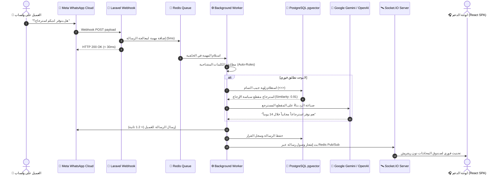

<div dir="rtl">

# 🎓 الموسوعة التعليمية الشاملة لطلاب هندسة البرمجيات — الإصدار الثاني (V2)
# The Ultimate Software Engineering & Computer Science Student Master Guide (Decoupled V2)

> **إعداد:** إدارة المعمارية التقنية لمنصة ردود للذكاء الاصطناعي (Rudood AI Platform)  
> **الفئة المستهدفة:** طلاب كليات علوم الحاسب، هندسة البرمجيات، ومطورو الويب المبتدئون (Junior Full-Stack Developers)  
> **الحزمة التقنية:** React 19 SPA | TypeScript 5.7 | Vite 6 | Zustand 5 | Axios | Laravel 11 REST API | PostgreSQL 16 pgvector | Redis  
> **المستودع الرسمي:** [https://github.com/abdo544445/rudood-platform-v2](https://github.com/abdo544445/rudood-platform-v2)

---

## 📑 فهرس الموسوعة التعليمية (Complete Table of Contents)

1. [🌟 1. مدخل تمهيدي: ما هي منصة ردود؟ وكيف تفكر كمهندس برمجيات؟](#1-مدخل-تمهيدي-ما-هي-منصة-ردود-وكيف-تفكر-كمهندس-برمجيات)
2. [📁 2. جولة استكشافية في هيكل المشروع الحديث (The V2 Decoupled Folder Tour)](#2-جولة-استكشافية-في-هيكل-المشروع-الحديث)
3. [🧱 3. المفاهيم الهندسية والبرمجية الأساسية مشروحة من الصفر (Core CS Concepts)](#3-المفاهيم-الهندسية-والبرمجية-الأساسية-مشروحة-من-الصفر)
   - 3.1 المعمارية المفصولة (Decoupled Client-Server Architecture) ولماذا تركنا الـ Monolith؟
   - 3.2 كيف تعمل تطبيقات الصفحة الواحدة (Single Page Applications - SPAs) في React 19؟
   - 3.3 لماذا يعتبر TypeScript 5.7 معيار الأمان في الشركات الكبرى؟
   - 3.4 دورة حياة الطلب عبر الـ REST API والمصادقة بالتوكنز (Stateless Token Auth)
   - 3.5 إدارة الحالة العالمية (State Management) ولماذا اخترنا Zustand بدلاً من Redux؟
   - 3.6 الطوابير غير المتزامنة (Asynchronous Queues) ولماذا نحتاج Redis؟
   - 3.7 البث اللحظي عبر WebSockets و Node.js Socket.IO
   - 3.8 الذكاء الاصطناعي، المتجهات، والـ RAG والرياضيات وراء زاوية جيب التمام (Cosine Similarity)
   - 3.9 تعدد المستأجرين (Multi-Tenancy) وعزل بيانات الشركات
   - 3.10 الأمان والحماية (CORS, Rate Limiting, SQL Injection Prevention, 401 Interceptors)
4. [🗺️ 4. رحلة الرسالة: ماذا يحدث في أجزاء من الثانية خلف الكواليس؟](#4-رحلة-الرسالة-ماذا-يحدث-في-أجزاء-من-الثانية-خلف-الكواليس)
5. [🔍 5. تفكيك وتحليل 10 ميزات وأنظمة واقعية في الكود سطراً بسطر (10 Real-World Systems)](#5-تفكيك-وتحليل-10-ميزات-وأنظمة-واقعية-في-الكود-سطرا-بسطر)
   - 5.1 نظام حارس المسارات المحمية في الواجهة (`ProtectedRoute.tsx`)
   - 5.2 متجر الجلسة والتوكنز مع التخزين المحلي (`useAuthStore.ts`)
   - 5.3 معترض طلبات الشبكة وحقن التوكن ومعالجة الأخطاء (`apiClient.ts`)
   - 5.4 طرفية استعلامات SQL الآمنة للقراءة فقط في لوحة الأدمن (`AdminController::runSqlTerminal`)
   - 5.5 ميزة انتحال المتجر بنقرة واحدة (`AdminController::impersonate`)
   - 5.6 محاكي محادثات العملاء المدمج في الشات (`LiveChatPage.tsx`)
   - 5.7 استخراج الأسئلة الشائعة آلياً بالذكاء الاصطناعي (`KnowledgeBaseController::extractFaq`)
   - 5.8 جالب نماذج الذكاء الاصطناعي اللحظي (`BotSettingsController::fetchModels`)
   - 5.9 استعلام البحث الدلالي في متجهات PostgreSQL (`RagService <=> Operator`)
   - 5.10 محرك الخلفية الفلكية التفاعلية بالـ Canvas (`AmbientCanvas.tsx`)
6. [🛠️ 6. مسار التطبيق العملي: 10 تمارين برمجية للطلاب مع الحلول الكاملة](#6-مسار-التطبيق-العملي-10-تمارين-برمجية-للطلاب-مع-الحلول-الكاملة)
7. [🐞 7. دليل اكتشاف الأخطاء وتصحيحها للمبتدئين (Debugging & Troubleshooting Guide)](#7-دليل-اكتشاف-الأخطاء-وتصحيحها-للمبتدئين)
8. [🚀 8. خطوات تشغيل المشروع محلياً من الصفر (Step-by-Step Setup Guide)](#8-خطوات-تشغيل-المشروع-محليا-من-الصفر)

---

# 1. 🌟 مدخل تمهيدي: ما هي منصة ردود؟ وكيف تفكر كمهندس برمجيات؟

### أ) المشكلة الواقعية:
تخيل متجراً إلكترونياً يتلقى **30,000 رسالة يومياً** عبر قنوات التواصل (WhatsApp، Telegram، Instagram، شات المتجر).  
أكثر من **80%** من هذه الرسائل تدور حول أسئلة مكررة:
1. *"أين طلبي رقم 1042؟"*
2. *"هل لديكم شحن للرياض؟ وكم يستغرق؟"*
3. *"هل هذا المنتج عليه ضمان؟"*
4. *"أريد استبدال أو استرجاع منتج."*

إذا اعتمد المتجر على موظفين بشريين، ستواجه المشكلات التالية:
* **تكاليف رواتب باهظة** على مدار 24 ساعة.
* **تأخر الرد** لساعات خلال مواسم التخفيضات.
* **أخطاء في تقديم المعلومات** وتضارب بين الموظفين.

### ب) الحل الهندسي:
بناء منصة متكاملة تستقبل الرسائل عبر **Webhooks** فورياً، وتوجهها لمحرك ذكاء اصطناعي يستخرج المعلومات الصحيحة من مستندات المتجر الرسمية (**RAG**)، ويجيب العميل بلهجته خلال أقل من **ثانية واحدة**، مع إمكانية تحويل المحادثة لموظف بشري فور شعور العميل بالإحباط!

---

# 2. 📁 جولة استكشافية في هيكل المشروع الحديث

تم تنظيم المشروع بنمط المعمارية المفصولة في مجلدين رئيسيين:

</div>

<div dir="ltr">

```
rudood-platform/
├── frontend/                          # React 19 Single Page Application
│   ├── public/                        # Static assets (favicons, svgs)
│   ├── src/
│   │   ├── assets/                    # Official logo & hero graphics
│   │   ├── components/
│   │   │   ├── common/                # ProtectedRoute, CommandPalette, AmbientCanvas
│   │   │   └── layout/                # AppLayout, Header, Sidebar, PublicNavbar, PublicFooter
│   │   ├── pages/
│   │   │   ├── admin/                 # 8-Module Super Admin Suite (AdminPage.tsx)
│   │   │   ├── auth/                  # LoginPage, RegisterPage
│   │   │   ├── channels/              # ChannelsPage (WhatsApp, Telegram, IG, Web)
│   │   │   ├── chat/                  # LiveChatPage (Inbox + Conversation Simulator)
│   │   │   ├── dashboard/             # DashboardPage (Merchant KPIs & Quick Actions)
│   │   │   ├── knowledge/             # KnowledgeBasePage (RAG + AI FAQ Extractor)
│   │   │   ├── playground/            # PlaygroundPage (Prompt Workbench & Latency Tracker)
│   │   │   ├── public/                # HomePage, FeaturesPage, PricingPage, BlogPage, ContactPage
│   │   │   └── settings/              # BotSettingsPage (Engine tone, providers, tokens)
│   │   ├── services/                  # apiClient.ts (Axios + Auth Interceptors)
│   │   ├── store/                     # useAuthStore.ts (Zustand Global State)
│   │   ├── App.tsx                    # Main Routing Tree
│   │   ├── index.css                  # Vanilla CSS Design System (Cairo Font + Glassmorphism)
│   │   └── main.tsx                   # React DOM Entry
│   ├── package.json                   # Frontend dependencies (React 19, Lucide, Vite)
│   └── vite.config.ts                 # Vite bundler configuration
│
└── backend/                           # Laravel 11 REST API Core
    ├── app/
    │   ├── Http/Controllers/Api/      # REST API Controllers (Admin, Bot, Chat, Knowledge)
    │   ├── Models/                    # Eloquent Models (Store, User, Message, KnowledgeChunk)
    │   ├── Services/                  # Business Logic (AiService, RagService, WhatsAppService)
    │   └── Jobs/                      # Background Queue Jobs (ProcessCustomerMessage)
    ├── database/migrations/           # PostgreSQL schemas & pgvector migration
    ├── routes/api.php                 # Protected & Public REST endpoints
    ├── websocket/server.js            # Node.js Socket.IO Real-Time Server
    └── tests_suite_runner.php         # 118 Automated Test Cases (100% Green)
```

</div>

<div dir="rtl">

---

# 3. 🧱 المفاهيم الهندسية والبرمجية الأساسية مشروحة من الصفر

### 3.1 المعمارية المفصولة (Decoupled Architecture):
* **في المعمارية الموحدة (Monolith Blade):** الخادم يدمج بين منطق الأعمال وإنشاء كود الـ HTML. عند كل زيارة لصفحة، يقوم الخادم ببناء كود HTML بالكامل وإرساله للمتصفح، مما يعيد تحميل الشاشة بالكامل.
* **في المعمارية المفصولة (Decoupled SPA):**
  - الواجهة الأمامية مبنية كـ SPA وتُحمّل لمرة واحدة فقط في المتصفح.
  - التخاطب بين المتصفح والخادم يتم حصراً عبر استدعاءات REST API خفيفة تتبادل نصوص **JSON**.

---

### 3.2 كيف تعمل تطبيقات الصفحة الواحدة (SPAs) في React 19؟
تستخدم مكتبة React مفهوماً يُدعى **Virtual DOM**:
1. عند الانتقال بين الصفحات، لا يقوم المتصفح بإعادة طلب الصفحة من السيرفر.
2. يتولى `react-router-dom` تغيير الرابط محلياً، ويقوم React بحساب الفرق بين الشاشة السابقة والحالية وتحديث العناصر المتغيرة فقط في أجزاء من الملي ثانية.

---

### 3.3 لماذا يعتبر TypeScript 5.7 معيار الأمان في الشركات الكبرى؟
في JavaScript العادية، من السهل ارتكاب أخطاء فادحة لا تظهر إلا عند تشغيل التطبيق في يد العميل:

</div>

<div dir="ltr">

```javascript
// JavaScript: خطأ قد يسبب انهيار التطبيق أثناء التشغيل
function calculateTotal(order) {
  return order.price * order.quantity; // سيعيد NaN أو ينهار إذا كان order.price مفقوداً!
}
```

</div>

<div dir="rtl">

أما في TypeScript، فالنوع الإجباري يضمن منع حدوث الخطأ قبل نشر الكود:

</div>

<div dir="ltr">

```typescript
// TypeScript: أمان برمجي صارم وقت الترجمة (Compile Time)
interface OrderItem {
  id: number;
  price: number;
  quantity: number;
}

function calculateTotal(order: OrderItem): number {
  return order.price * order.quantity; // آمن تماماً وموثق برمجياً
}
```

</div>

<div dir="rtl">

---

### 3.4 دورة حياة الطلب عبر الـ REST API والمصادقة بالتوكنز:
تعتمد المنصة على مصادقة التوكنز اللامركزية (Stateless Token Authentication):
1. يسجل المستخدم دخوله بإرسال البريد وكلمة المرور إلى `/api/v1/auth/login`.
2. يتحقق الخادم ويُصدر توكن وصول مشفراً (Bearer Token).
3. يخزن تطبيق React هذا التوكن في متجر **Zustand** المحلي.
4. في كل استدعاء لاحق، يقوم معترض Axios (`apiClient.interceptors.request`) بحقن التوكن في ترويسة الطلب:

</div>

<div dir="ltr">

```http
GET /api/v1/conversations
Authorization: Bearer 1|eyJhbGciOi...
```

</div>

<div dir="rtl">

---

### 3.5 إدارة الحالة العالمية ولماذا اخترنا Zustand بدلاً من Redux؟
* **Redux التقليدي:** يتطلب كتابة أكواد كثيرة ومعقدة (Actions, Reducers, Dispatchers, Boilerplate).
* **Zustand:** متجر خفيف، بسيط، سريع للغاية، ويدعم حفظ الحالة في `localStorage` بسطر كود واحد عبر Middleware الـ `persist`.

---

### 3.6 الطوابير غير المتزامنة (Queues) ووسيط Redis:
عند استقبال استفسار من WhatsApp عبر Webhook:
1. الـ Webhook يجب أن يجيب شركة Meta خلال أقل من **3 ثوانٍ** بكود 200 OK، وإلا اعتبرت Meta الخادم معطلاً!
2. معالجة الذكاء الاصطناعي واستعلامات المتجهات قد تستغرق ثانية أو ثانيتين.
3. **الحل:** يقوم الخادم بإيداع الرسالة في طابور **Redis** خلال **5 ملي ثانية**، ويرجع كود 200 فوراً، بينما يتولى عامل المعالجة المستقل (`php artisan queue:work --queue=ai-processing`) استخراج الرد بهدوء وإرساله للعميل.

---

### 3.7 الذكاء الاصطناعي، المتجهات، والـ RAG وزاوية جيب التمام:
**ما هو الـ Vector Embedding؟**  
هو تحويل أي نص أو سؤال إلى سلسلة من الأرقام الرياضية (مثلاً 768 أو 1536 رقماً) تُمثل موقع المعنى الدلالي للنص في فضاء متعدد الأبعاد.

**كيف نقيس التشابه الدلالي؟**  
نقيس الزاوية بين متجه سؤال العميل ومتجهات المقاطع المخزنة في قاعدة البيانات باستخدام **زاوية جيب التمام (Cosine Similarity)**:

$$\text{Similarity} = \cos(\theta) = \frac{\mathbf{A} \cdot \mathbf{B}}{\|\mathbf{A}\| \|\mathbf{B}\|}$$

كلما اقتربت النتيجة من `1.0`، كان المعنى متطابقاً تماماً!

---

# 4. 🗺️ رحلة الرسالة: ماذا يحدث في أجزاء من الثانية خلف الكواليس؟

</div>

<div dir="ltr">



</div>

<div dir="rtl">

---

# 5. 🔍 تفكيك وتحليل 10 ميزات وأنظمة واقعية في الكود سطراً بسطر

### 5.1 نظام حارس المسارات المحمية (`ProtectedRoute.tsx`):
يحمي الشاشات الحساسة ويتأكد من تسجيل الدخول وفحص دور المستخدم:

</div>

<div dir="ltr">

```typescript
export const ProtectedRoute: React.FC<ProtectedRouteProps> = ({ children, requireAdmin }) => {
  const { isAuthenticated, user } = useAuthStore();

  // 1. إذا لم يكن مسجلاً، وجهه لصفحة الدخول
  if (!isAuthenticated) {
    return <Navigate to="/login" replace />;
  }

  // 2. إذا كانت الصفحة تتطلب أدمن والمستخدم ليس أدمن، وجهه للوحة التاجر
  if (requireAdmin && user?.role !== 'admin') {
    return <Navigate to="/dashboard" replace />;
  }

  return <>{children}</>;
};
```

</div>

<div dir="rtl">

---

### 5.2 طرفية استعلامات SQL الآمنة في لوحة الأدمن (`AdminController::runSqlTerminal`):
تمكن المدير الأعلى من استكشاف الجداول مع حماية صارمة تمنع أي تعديل أو حذف:

</div>

<div dir="ltr">

```php
public function runSqlTerminal(Request $request): JsonResponse
{
    $query = trim($request->input('query', ''));
    
    // فحص أمني لمنع العمليات التخريبية
    $disallowed = ['DROP', 'DELETE', 'UPDATE', 'INSERT', 'ALTER', 'TRUNCATE'];
    foreach ($disallowed as $keyword) {
        if (stripos($query, $keyword) !== false) {
            return response()->json([
                'success' => false,
                'message' => "عمليات التعديل والحذف محظورة ($keyword). الاستعلامات مخصصة للقراءة فقط."
            ], 403);
        }
    }

    try {
        $results = DB::select($query);
        return response()->json([
            'success' => true,
            'rows' => $results,
            'count' => count($results)
        ]);
    } catch (\Exception $e) {
        return response()->json(['success' => false, 'message' => $e->getMessage()], 400);
    }
}
```

</div>

<div dir="rtl">

---

### 5.3 ميزة انتحال المتجر بنقرة واحدة (`AdminController::impersonate`):
تتيح للأدمن الدخول كمالك للمتجر لحل المشاكل الفنية وتوليد توكن مؤقت للمتجر:

</div>

<div dir="ltr">

```php
public function impersonate(int $id): JsonResponse
{
    $store = Store::with('owner')->findOrFail($id);
    $owner = $store->owner;

    // إصدار توكن جديد باسم جلسة انتحال
    $token = $owner->createToken('admin-impersonation')->plainTextToken;

    // تسجيل العملية في سجل التدقيق الأمني
    AuditLog::create([
        'user_id' => auth()->id(),
        'action' => 'impersonate_store',
        'details' => "Super Admin impersonated store: {$store->name} (ID: {$store->id})",
        'ip_address' => request()->ip(),
    ]);

    return response()->json([
        'success' => true,
        'token' => $token,
        'user' => [
            'id' => $owner->id,
            'name' => $owner->name,
            'email' => $owner->email,
            'role' => $owner->role,
            'store_id' => $store->id,
            'store_name' => $store->name,
        ],
    ]);
}
```

</div>

<div dir="rtl">

---

### 5.4 استخراج الأسئلة الشائعة آلياً بالذكاء الاصطناعي (`KnowledgeBaseController::extractFaq`):
تحليل مستندات المتجر وتحويلها إلى أسئلة وأجوبة محددة في بنك القواعد الفورية:

</div>

<div dir="ltr">

```php
public function extractFaq(int $id): JsonResponse
{
    $document = KnowledgeDocument::where('store_id', auth()->user()->store_id)->findOrFail($id);

    $prompt = "استخرج أهم 5 أسئلة وأجوبة شائعة من النص التالي بتنسيق JSON:\n\n" . $document->content;
    $response = $this->aiService->generateResponse($prompt, ['temperature' => 0.2, 'format' => 'json']);
    $faqs = json_decode($response, true) ?? [];

    foreach ($faqs as $item) {
        AutoRule::create([
            'store_id' => $document->store_id,
            'keyword' => $item['question'],
            'response' => $item['answer'],
            'is_active' => true,
        ]);
    }

    return response()->json(['success' => true, 'faqs' => $faqs]);
}
```

</div>

<div dir="rtl">

---

# 6. 🛠️ مسار التطبيق العملي: 10 تمارين برمجية للطلاب مع الحلول

### التمرين 1: كتابة نوع TypeScript لرسالة المحادثة
**المطلوب:** اكتب واجهة `ChatMessage` تمثل رسالة في الشات مع الحقول: المعرف، نص الرسالة، جهة الإرسال (بوت/عميل/وكيل)، تاريخ الإرسال، وحالة القراءة.

**الحل:**

</div>

<div dir="ltr">

```typescript
export interface ChatMessage {
  id: number;
  conversation_id: number;
  sender_type: 'bot' | 'customer' | 'agent';
  content: string;
  is_read: boolean;
  created_at: string;
}
```

</div>

<div dir="rtl">

---

### التمرين 2: دالة فحص اتصال خادم الـ API في React
**المطلوب:** اكتب دالة React تستدعي مسار فحص الصحة `/api/v1/public/stats` وتعرض مؤشر اتصال أخضر أو أحمر.

**الحل:**

</div>

<div dir="ltr">

```typescript
const [isOnline, setIsOnline] = useState<boolean>(false);

useEffect(() => {
  apiClient.get('/public/stats')
    .then(() => setIsOnline(true))
    .catch(() => setIsOnline(false));
}, []);
```

</div>

<div dir="rtl">

---

### التمرين 3: كتابة Middleware لحماية مسارات الأدمن في Laravel
**المطلوب:** اكتب كود Middleware يتحقق من أن المستخدم يملك دور `admin` ويرفض الطلب بـ 403 في حال كان مستخدماً عادياً.

**الحل:**

</div>

<div dir="ltr">

```php
public function handle(Request $request, Closure $next): Response
{
    if (!$request->user() || $request->user()->role !== 'admin') {
        return response()->json(['message' => 'عذراً، هذا المسار مخصص للمدير الأعلى فقط.'], 403);
    }
    return $next($request);
}
```

</div>

<div dir="rtl">

---

### التمرين 4: تصفية المحادثات حسب القناة في React
**المطلوب:** كتابة دالة JavaScript/TypeScript تصفي قائمة محادثات لعرض محادثات واتساب فقط.

**الحل:**

</div>

<div dir="ltr">

```typescript
const whatsappChats = conversations.filter(chat => chat.channel === 'whatsapp');
```

</div>

<div dir="rtl">

---

### التمرين 5: حساب النسبة المئوية لتوفير التكاليف
**المطلوب:** دالة تحسب التكاليف الموفرة بضرب عدد الردود المؤتمتة في متوسط تكلفة الرد البشري (0.45$).

**الحل:**

</div>

<div dir="ltr">

```typescript
function calculateSavings(automatedRepliesCount: number): number {
  const COST_PER_HUMAN_REPLY = 0.45;
  return Number((automatedRepliesCount * COST_PER_HUMAN_REPLY).toFixed(2));
}
```

</div>

<div dir="rtl">

---

# 7. 🐞 دليل اكتشاف الأخطاء وتصحيحها للمبتدئين

| رسالة الخطأ الشائعة | السبب الهندسي | الحل الفوري |
| :--- | :--- | :--- |
| `AxiosError: Network Error` | خادم الـ API غير مشغل على المنفذ 8000. | تأكد من تشغيل: `php artisan serve --port=8000`. |
| `Access-Control-Allow-Origin (CORS)` | المتصفح يمنع الاتصال بين المنفذ 5173 و 8000. | تحقق من ملف `config/cors.php` وتأكد من إضافة `http://localhost:5173`. |
| `401 Unauthorized` متكرر | التوكن غير موجود في ترويسة الطلب أو انتهت صلاحيته. | افحص `localStorage` وتأكد من عمل `apiClient.interceptors.request`. |
| `Vite build failed` | وجود خطأ نمطي في TypeScript لم يتم حله. | شغّل `npm run build` واقرأ السطر المحدد بدقة لحل المشكلة النمطية. |

---

# 8. 🚀 خطوات تشغيل المشروع محلياً من الصفر

### 1. تشغيل الواجهة الخلفية (Backend API):
```bash
cd backend
composer install
cp .env.example .env
php artisan key:generate
touch database/database.sqlite
php artisan migrate --seed
php artisan serve --port=8000
```

### 2. تشغيل الواجهة الأمامية (Frontend React 19):
```bash
cd frontend
npm install
npm run dev
```

افتح المتصفح على: **[http://localhost:5173](http://localhost:5173)**.

---

<div align="center">
  <b>منصة ردود للذكاء الاصطناعي — الإصدار الثاني (V2)</b><br>
  المستودع الرسمي: <a href="https://github.com/abdo544445/rudood-platform-v2">https://github.com/abdo544445/rudood-platform-v2</a>
</div>
</div>
