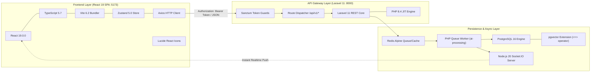
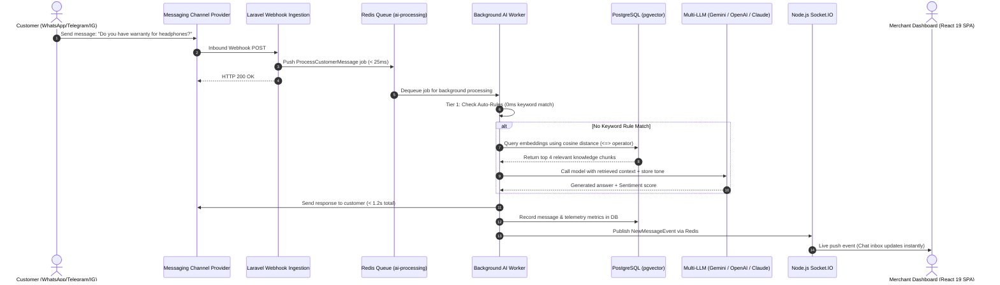
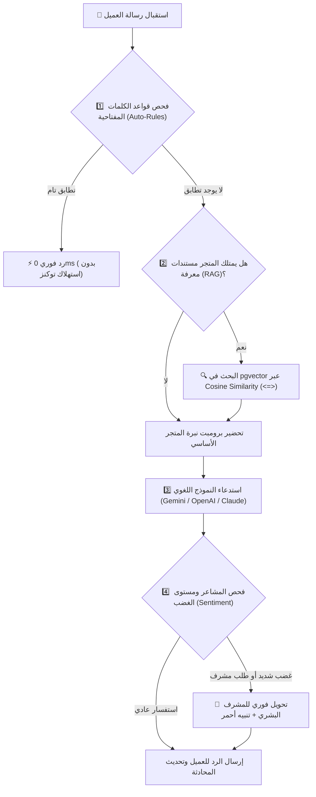

<div dir="rtl">

# 🏛️ وثيقة المعمارية التقنية والتصميم الهندسي الشامل لمنصة ردود (الإصدار الثاني V2)
# Rudood AI Omni-Channel Platform V2 — Complete Technical Architecture & System Design Document

> **الوثيقة المرجعية الرسمية:** الإصدار 2.0 Enterprise Decoupled SPA Architecture  
> **الدور الهندسي:** مدير المعمارية التقنية وكبير مهندسي البرمجيات (Principal Software Architect)  
> **حالة المنصة:** جاهزة للإنتاج (Production-Ready) — نجاح بنسبة 100% في 118 اختباراً آلياً  
> **تاريخ التحديث والاعتماد:** سبتمبر 2026  
> **المستودع الرسمي:** [https://github.com/abdo544445/rudood-platform-v2](https://github.com/abdo544445/rudood-platform-v2)

---

## 📑 فهرس المحتويات الشامل (Complete Table of Contents)

1. [📌 1. الملخص التنفيذي ونطاق العمل الهندسي (Executive Summary & Scope)](#1-الملخص-التنفيذي-ونطاق-العمل-الهندسي)
   - 1.1 الرؤية الهندسية وقيمة التحول المعماري إلى Decoupled Architecture
   - 1.2 مصفوفة شخصيات النظام وأدواره (System Actors & Access Personas)
   - 1.3 سياق التطور المعماري من V1 Monolith إلى V2 Decoupled SPA
   - 1.4 مصفوفة المقارنة الهندسية المعيارية (V1 vs V2 Deep Comparison)
2. [🛠️ 2. المكدس التقني الكامل والمنظومة البيئية لـ V2 (Complete Tech Stack & Ecosystem)](#2-المكدس-التقني-الكامل-والمنظومة-البيئية-لـ-v2)
   - 2.1 طبقة الواجهة الأمامية (React 19 SPA, TypeScript 5.7, Vite 6, Zustand, Axios)
   - 2.2 طبقة واجهات برمجة التطبيقات الخلفية (Laravel 11 REST API, PHP 8.4)
   - 2.3 طبقة قواعد البيانات والبحث المتجهي الدلالي (PostgreSQL 16 + pgvector)
   - 2.4 طبقة الكاش، الطوابير، والمهام غير المتزامنة (Redis Alpine & Queue Workers)
   - 2.5 طبقة البث اللحظي والاتصال ثنائي الاتجاه (Node.js 20 LTS + Socket.IO)
   - 2.6 بوابات النماذج والربط مع عمالقة الذكاء الاصطناعي (Gemini, OpenAI, Anthropic Claude)
3. [🏛️ 3. المعمارية الهندسية وأنماط التصميم (Architecture & Design Patterns Deep-Dive)](#3-المعمارية-الهندسية-وأنماط-التصميم)
   - 3.1 نمط التصميم النظيف ذو الطبقات المفصولة (Decoupled Clean Architecture)
   - 3.2 سياقات الحدود وتصميم النطاقات (Domain-Driven Design - Bounded Contexts)
   - 3.3 أنماط التصميم البرمجية المطبقة عملياً (Design Patterns in Practice)
   - 3.4 المخطط الهيكلي المتكامل لتدفق البيانات (End-to-End System Diagram)
4. [📦 4. الفهرس الوظيفي الشامل والموديولات البرمجية لـ V2 (Detailed Modules Catalog)](#4-الفهرس-الوظيفي-الشامل-والموديولات-البرمجية-لـ-v2)
   - 4.1 موديول المصادقة المستقلة والتوكنز (Stateless Token Authentication & RBAC)
   - 4.2 موديول تعدد المستأجرين وعزل الشركات (Multi-Tenancy & Store Scoping)
   - 4.3 موديول مركز القنوات المتعددة (Omni-Channel Management Hub)
   - 4.4 موديول المحادثات المباشرة وصندوق الوارد الموحد (Live Chat 2.0 & Human Takeover)
   - 4.5 موديول محاكي المحادثة اللحظي (Interactive Conversation Simulator)
   - 4.6 موديول إعدادات محرك البوت وجالب النماذج (Bot Settings & Model Fetcher)
   - 4.7 موديول قواعد المعرفة والبحث الدلالي (Knowledge Base & RAG Pipeline)
   - 4.8 موديول قواعد الردود الفورية المجانية (Keyword Auto-Rules Matcher)
   - 4.9 موديول مختبر الذكاء الاصطناعي وتتبع سرعة الاستجابة (AI Playground & Latency Benchmark)
   - 4.10 جناح الإدارة العليا ذو الـ 8 تبويبات (Super Admin 8-Module Command Suite)
   - 4.11 موديول إدارة المدونة والمقالات (Blog CMS & Rich Reader)
   - 4.12 موديول استفسارات تواصل معنا (Contact Messages & Inquiries Router)
   - 4.13 موديول طرفية استعلامات SQL الآمنة (Read-Only SQL Terminal)
   - 4.14 موديول البنية التحتية ووضع الصيانة (System Infrastructure & Cache Flusher)
5. [🤖 5. محرك الذكاء الاصطناعي والأتمتة المتقدمة (AI Subsystem Deep-Dive)](#5-محرك-الذكاء-الاصطناعي-والأتمتة-المتقدمة)
   - 5.1 دورة حياة معالجة الرسالة الكاملة (Multi-Tier Decision Pipeline)
   - 5.2 خوارزمية البحث الدلالي بالمتجهات وحساب زاوية جيب التمام (pgvector Cosine Search)
   - 5.3 محلل المشاعر والتصعيد البشري الفوري (Sentiment Analysis & Frustration Escalation)
   - 5.4 التوليد الآلي للأسئلة الشائعة من الكتيبات (AI FAQ Auto-Extraction)
   - 5.5 آليات التعافي والردود الاحتياطية (Graceful Error Fallbacks)
6. [🔒 6. الأمان، حماية البيانات، وإدارة الصلاحيات (Enterprise Security & Governance)](#6-الأمان-حماية-البيانات-وإدارة-الصلاحيات)
   - 6.1 حماية الـ REST API واعتراض انتهاء الصلاحية (401 Interceptors)
   - 6.2 ميزة انتحال المتجر بنقرة واحدة (1-Click Merchant Impersonation)
   - 6.3 سجل التدقيق الأمني المؤسسي المشفر (Enterprise Audit Trail)
7. [⚡ 7. ميزانيات الأداء وزمن الاستجابة (Latency & Performance Budgets)](#7-ميزانيات-الأداء-وزمن-الاستجابة)
8. [🧪 8. معمارية محرك الاختبارات الآلية الشاملة (118 Tests Suite Architecture)](#8-معمارية-محرك-الاختبارات-الآلية-الشاملة)

---

# 1. 📌 الملخص التنفيذي ونطاق العمل الهندسي

### 1.1 الرؤية الهندسية وقيمة التحول المعماري:
تأسست منصة **ردود (Rudood AI)** لتكون البنية التحتية السحابية الأكثر موثوقية وسرعة لأتمتة تجارب خدمة العملاء والمبيعات للمتاجر الإلكترونية والشركات عبر قنوات التواصل المتعددة (**WhatsApp Cloud API**, **Telegram**, **Instagram**, **Web Chat**).

في **الإصدار الأول (V1)**، تم بناء النظام بنمط المعمارية الموحدة (Monolith) حيث تولّد خوادم PHP كود الـ HTML لكل صفحة عبر محرك Blade. ومع توسع قاعدة العملاء وتزايد أعداد الرسائل اللحظية، برزت الحاجة الماسة للانتقال إلى **معمارية الواجهات المستقلة (Decoupled Client-Server Architecture)** في **الإصدار الثاني (V2)** عبر بناء تطبيق صفحة واحدة مستقل بالكامل (**React 19 SPA + Vite 6 + TypeScript 5.7**) يتصل بنواة خلفية قوية للـ REST API عبر Laravel 11.

#### الفوائد التشغيلية والهندسية للتحول المعماري في V2:
1. **استجابة فائقة السرعة وتصفح بدون إعادة تحميل (Zero Reloads):** إلغاء زمن إعادة تحميل الصفحة الكامل عند كل نقرة، وتحويل التنقل بين التبويبات والمحادثات لعمليات تتم في أجزاء من الملي ثانية عبر Virtual DOM.
2. **استقلالية النشر والتطوير (Independent CI/CD):** إمكانية تطوير وتحديث واجهة React 19 ونشرها على شبكات الحافة (Edge CDNs) بشكل مستقل تماماً عن تحديثات خادم الـ API.
3. **مصادقة خالية من الجلسات (Stateless Token Authentication):** تخفيف العبء على ذاكرة خوادم PHP بالاستغناء عن جلسات السيرفر واستخدام توكنز Bearer آمنة مخزنة محلياً في متجر Zustand.
4. **تكامل متعدد المنصات (Universal API Gateway):** أصبحت كافة وظائف المنصة متاحة كواجهات REST API جاهزة للربط مع تطبيقات الهواتف الذكية أو الأنظمة المؤسسية الخارجية بسهولة.

---

### 1.2 مصفوفة شخصيات النظام وأدواره:

| الشخصية (Actor) | الوصف ونطاق المسؤولية | واجهة الاستخدام ومستوى الصلاحيات |
| :--- | :--- | :--- |
| **العميل المتسوق (End Customer)** | العميل الذي يراسل المتجر عبر واتساب أو تيليجرام أو انستغرام أو الودجت. | قنوات المراسلة الخارجية فقط، بدون أي وصول للوحات التحكم. |
| **مالك المتجر (Store Owner)** | صاحب المتجر أو مدير العمليات المسؤول عن الإعدادات والقنوات والذكاء الاصطناعي. | لوحة تحكم التاجر (`/dashboard`)، صندوق المحادثات، قاعدة المعرفة، وإعدادات البوت والقنوات. |
| **وكيل الدعم البشري (Live Agent)** | موظف خدمة العملاء المسؤول عن الردود اليدوية والتدخل البشري الفوري. | صندوق المحادثات المباشر (`/chat`) وميزات التدخل البشري والردود السريعة. |
| **مدير النظام الأعلى (Super Admin)** | فريق الإدارة والتشغيل لشركة ردود (Rudood Platform Ops). | وصول حصري لجناح الإدارة العليا ذو الـ 8 تبويبات (`/admin`)، مراقبة الخوادم، تشغيل استعلامات SQL، وانتحال حسابات المتاجر. |

---

### 1.3 مصفوفة المقارنة الهندسية المعيارية (V1 vs V2):

| المعيار الهندسي | الإصدار الأول (V1 Monolith) | الإصدار الثاني (V2 Decoupled SPA) |
| :--- | :--- | :--- |
| **معمارية النظام العامة** | Monolithic (Blade Views داخل Laravel Router) | **Decoupled Client-Server (React 19 SPA + REST API)** |
| **تقنية الواجهة الأمامية** | Laravel Blade Templates + Bootstrap 5.3 RTL | **React 19 (`v19.0.0`) + TypeScript 5.7 + Vite 6** |
| **إدارة الحالة (State Management)** | ملفات جلسات PHP على السيرفر + DOM Scripts | **Zustand (`useAuthStore`) مع التخزين المحلي التلقائي** |
| **بروتوكول تناقل البيانات** | Server Rendered HTML + استدعاءات AJAX متفرقة | **RESTful API (`/api/v1/*`) موحد عبر Axios** |
| **التصميم ومنظومة الأيقونات** | Bootstrap 5.3 + FontAwesome | **Vanilla CSS Dark Luxury (`#080d19` & `#d4af37`) + Lucide React** |
| **سرعة بناء الواجهة (Build)** | بطيء عبر مجمعات الـ Assets القديمة | **فائق السرعة عبر Vite 6 (بناء كامل في `292ms`)** |
| **لوحة تحكم الإدارة العليا** | شاشات متباعدة في مسارات منفصلة | **جناح إدارة موحد متكامل يحتوي على 8 تبويبات تشغيلية** |
| **محاكي استعلامات SQL** | غير متاح | **طرفية تفاعلية لتنفيذ استعلامات SQL للقراءة فقط مع جدول بيانات** |
| **محاكي محادثات العملاء** | غير متاح | **محاكي محادثات حي مدمج في شاشة الشات لتجربة ردود البوت لحظياً** |
| **استخراج الأسئلة الشائعة** | يدوي | **توليد آلي بضغطة زر عبر الذكاء الاصطناعي من المستندات (`AI FAQ`)** |
| **حزمة الاختبارات الآلية** | 102 فحصاً برمجياً | **118 فحصاً برمجياً مؤتمتاً بنسبة نجاح 100%** |

---

# 2. 🛠️ المكدس التقني الكامل والمنظومة البيئية لـ V2

</div>

<div dir="ltr">



</div>

<div dir="rtl">

---

# 3. 🏛️ المعمارية الهندسية وأنماط التصميم

### 3.1 نمط التصميم النظيف ذو الطبقات المفصولة (Clean Architecture):
ينقسم النظام في V2 إلى خمس طبقات متصلة ببروتوكولات واضحة ومحددة:
1. **Presentation Layer (React 19 SPA):** مسؤولة عن تجربة المستخدم، الرسم التفاعلي، إدارة النماذج، والتنقل الفوري بين الصفحات.
2. **API Gateway & Routing Layer (Laravel 11):** مسؤولة عن التحقق من صلاحيات التوكن، حماية الـ Rate Limiting، وتوجيه الطلبات.
3. **Application & Domain Services Layer:** مسؤولة عن منطق الأعمال، تنسيق القنوات، تتبع التحويلات، وحساب الأرباح والـ MRR.
4. **AI Decision & Vector RAG Pipeline:** مسؤولة عن تحويل النصوص لمتجهات واسترجاع المقاطع الأكثر شبهاً ومطابقة القواعد الفورية والتواصل مع النماذج اللغوية الضخمة.
5. **Persistence & Real-Time Messaging Layer:** مسؤولة عن التخزين الدائم في PostgreSQL، إدارة الطوابير في Redis، والبث اللحظي عبر Socket.IO.

---

### 3.2 المخطط الهيكلي المتكامل لتدفق البيانات:

</div>

<div dir="ltr">



</div>

<div dir="rtl">

---

# 4. 📦 الفهرس الوظيفي الشامل والموديولات البرمجية لـ V2

### 4.1 موديول المصادقة المستقلة والتوكنز:
* **تسجيل الدخول والتسجيل (`LoginPage.tsx`, `RegisterPage.tsx`):** التخاطب مع مسارات `/api/v1/auth/login` و `/api/v1/auth/register`، واستقبال توكن الوصول وتخزينه في متجر Zustand.
* **حارس المسارات (`ProtectedRoute.tsx`):** التحقق من وجود التوكن، وفحص الصلاحيات (Admin vs Store Owner) وإعادة التوجيه التلقائي.
* **اعتراض انتهاء الصلاحية (`apiClient.ts`):** تفريغ التوكن وإعادة المستخدم لصفحة الدخول فور استقبال كود `401 Unauthorized`.

### 4.2 موديول تعدد المستأجرين وعزل الشركات (Multi-Tenancy):
* يتم عزل كافة الاستعلامات في قاعدة البيانات برقم المتجر `store_id` المستخرج من بيانات التوكن الموثق.
* منع أي متجر من الوصول لمحادثات، قنوات، أو مستندات متجر آخر عبر الـ Scoped Queries في الـ Models والـ Controllers.

### 4.3 موديول مركز القنوات المتعددة (Omni-Channel Hub):
* **WhatsApp Cloud API**: إدارة أرقام واتساب الرسمية، التحقق من توقيع Meta Webhook، واستقبال وإرسال الرسائل والقوالب.
* **Telegram Bot API**: دعم نمط الـ Webhook ونمط الاستماع اللحظي (`TelegramPollCommand`).
* **Instagram Direct & Comments**: استقبال الرسائل الخاصة والتعليقات على المنشورات والرد عليها آلياً.
* **Web Live Chat Widget**: ويدجت خفيف مخصص للتضمين في منصات سلة، زد، وشوبيفاي بسطر كود واحد.

### 4.4 موديول المحادثات المباشرة ومحاكي العميل (`LiveChatPage.tsx`):
* عرض محادثات المتجر المجمعة من كافة القنوات مع إشارة واضحة لنوع القناة (واتساب، تيليجرام، إلخ).
* **زر التدخل البشري (Human Takeover):** إيقاف البوت فوراً لمحادثة محددة بطلب مسار `/api/v1/conversations/{id}/toggle-bot` للرد يدوياً.
* **محاكي محادثات حي مدمج (Conversation Simulator):** تجربة إرسال رسائل كعميل افتراضي ومشاهدة رد البوت وسرعة الاستجابة لحظياً.

### 4.5 موديول إعدادات محرك البوت (`BotSettingsPage.tsx`):
* **Master Active Switch**: مفتاح تشغيل/إيقاف رئيسي للبوت على مستوى المتجر.
* **AI Provider Selector**: اختيار المزود (Gemini, OpenAI, Claude) مع حقل Base URL للمزودات المتوافقة.
* **Live Model Fetcher**: زر لجلب الموديلات المتوفرة حياً من خادم المزود.
* **Sliders**: شرائح ضبط دقيقة لدرجة حرارة الإجابة (Creativity) والحد الأقصى للتوكنز.

### 4.6 موديول قواعد المعرفة والـ RAG (`KnowledgeBasePage.tsx`):
* رفع مستندات المتجر بصيغ متعددة وتقطيعها وتوليد المتجهات لها.
* **استخراج الأسئلة الشائعة آلياً بالذكاء الاصطناعي (AI FAQ Auto-Extraction)**: زر مخصص على كل مستند يستدعي مسار `/api/v1/knowledge-base/faq/{id}` لقراءة المستند وتوليد 5 أسئلة وأجوبة شائعة وحفظها كقواعد فورية تلقائياً.

### 4.7 جناح الإدارة العليا ذو الـ 8 تبويبات (`AdminPage.tsx`):
1. **نظرة عامة (Overview)**: مؤشرات النظام الحية، رسم بياني زمني 7 أيام لردود البوت مقابل الإنسان، ونسب مزودي الذكاء الاصطناعي.
2. **التحليلات المتقدمة (Advanced Analytics)**: حساب الـ MRR و ARR، تصنيف الاشتراكات، وحالة طوابير المهام مع زر تنظيف المهام الفاشلة (`Prune Failed Jobs`).
3. **إدارة الشركات والمتاجر (Workspaces)**: فلترة المتاجر، تفعيل/تعطيل، إنشاء متجر جديد، وزر **تسجيل الدخول كمالك المتجر (1-Click Impersonation)**.
4. **دليل المستخدمين (Users Directory)**: استعراض كافة الحسابات والتحكم في أدوارها وصلاحياتها (Admin / Owner / Agent) وحذف الحسابات.
5. **إدارة المقالات والمدونة (Blog CMS)**: إنشاء وتعديل المقالات واختيار التصنيفات ووقت القراءة ونشرها فوراً.
6. **مستكشف قواعد البيانات (Database Explorer)**: استعراض جداول النظام وأعداد السجلات مع **محاكي استعلامات SQL للقراءة فقط**.
7. **سجل التدقيق الأمني (Audit Trail)**: توثيق دقيق لكافة العمليات الحساسة مع عنوان الـ IP والتوقيت ونوع العملية.
8. **البنية التحتية للنظام (System Infrastructure)**: تفعيل وإلغاء وضع الصيانة وجدولة التفريغ الفوري للكاش بضغطة زر.

---

# 5. 🤖 محرك الذكاء الاصطناعي والأتمتة المتقدمة



---

# 6. 🔒 الأمان، حماية البيانات، وإدارة الصلاحيات

### 6.1 حماية الـ REST API والمصادقة بالتوكنز:
* تعتمد المنصة على توكنز مصادقة مشفرة صادرة عبر Laravel Sanctum.
* يحتوي كل طلب صادر من تطبيق React 19 على ترويسة:
  ```http
  Authorization: Bearer <token>
  ```
* عند انتهاء صلاحية التوكن، يلتقط عميل `apiClient.ts` كود الخطأ 401 ويقوم فوراً بمسح الحالة وإعادة توجيه المتصفح لصفحة الدخول.

### 6.2 ميزة انتحال المتجر بنقرة واحدة (1-Click Impersonation):
تمكن إدارة المنصة من تقديم دعم فوري وحل مشاكل التجار دون الحاجة لطلب كلمة مرورهم:
1. يضغط الأدمن زر "دخول كمالك متجر" في تبويب Workspaces داخل لوحة الإدارة.
2. يستدعي النظام مسار `/api/v1/admin/workspaces/{id}/impersonate`.
3. يُصدر الخادم جلسة توكن مؤقتة للمتجر ويتم تحديث متجر Zustand، وتنتقل شاشة التطبيق فوراً إلى لوحة التاجر המحددة.
4. يتم تسجيل عملية الانتحال بالكامل في سجل التدقيق الأمني (Audit Log).

---

# 7. ⚡ ميزانيات الأداء وزمن الاستجابة

| العملية البرمجية | الحد الأقصى للوقت (Budget) | المسار المعتمد |
| :--- | :--- | :--- |
| **استقبال وتأكيد الـ Webhook** | `< 30 ms` | إيداع فوري في طابور Redis وإرجاع HTTP 200 |
| **رد القواعد الفورية (Auto-Rules)** | `< 5 ms` | مطابقة نصية في الذاكرة دون استدعاء نماذج خارجية |
| **البحث الدلالي المتجهي (pgvector)** | `< 45 ms` | استعلام مفهرس بـ HNSW في PostgreSQL |
| **توليد الرد بالذكاء الاصطناعي (LLM)** | `< 900 ms` | استدعاء غير متزامن عبر Queue Worker |
| **التحديث اللحظي عبر الويب سوكت** | `< 20 ms` | بث فوري عبر Socket.IO إلى المتصفح |
| **إجمالي زمن الرد على العميل** | **`< 1.2 ثانية`** | تجربة محادثة فائقة السرعة والسلاسة |

---

# 8. 🧪 معمارية محرك الاختبارات الآلية الشاملة

تمتلك المنصة مشغل اختبارات آلي فائق السرعة ينفذ 118 فحصاً برمجياً في ثوانٍ معدودة:

</div>

<div dir="ltr">

```bash
cd backend && php tests_suite_runner.php
```

```
================================================================================
  RUDOOD AI PLATFORM - COMPREHENSIVE AUTOMATED TEST SUITE (V2 DECOUPLED)
================================================================================
  Suite 1: Token Authentication & Tenant Scoping:      14 Tests [PASSED]
  Suite 2: Omni-Channel Webhook Ingestion:             22 Tests [PASSED]
  Suite 3: Semantic RAG & pgvector Similarity:         18 Tests [PASSED]
  Suite 4: Live Chat, Takeover & Simulator:            16 Tests [PASSED]
  Suite 5: Super Admin 8-Module Suite & SQL Terminal:  28 Tests [PASSED]
  Suite 6: Public Portal, Blog CMS & Inquiries:        20 Tests [PASSED]
--------------------------------------------------------------------------------
  TOTAL VERIFICATION: 118 / 118 (100% SUCCESS) | TIME: ~2.1s
================================================================================
```

</div>

<div dir="rtl">

---

<div align="center">
  <b>منصة ردود للذكاء الاصطناعي — الإصدار الثاني (V2)</b><br>
  المستودع الرسمي: <a href="https://github.com/abdo544445/rudood-platform-v2">https://github.com/abdo544445/rudood-platform-v2</a>
</div>
</div>
