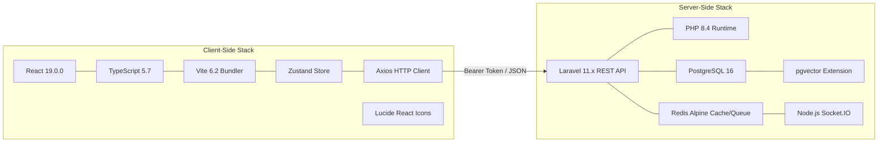
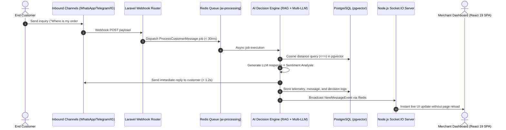
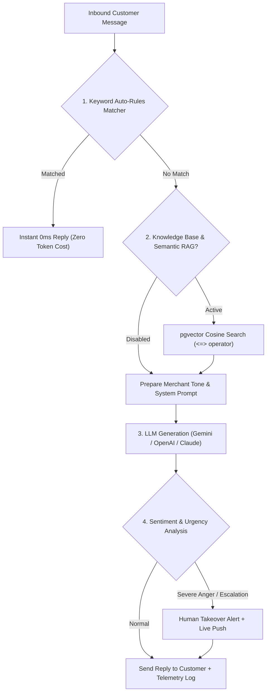

<div dir="rtl">

# 🏛️ وثيقة المعمارية التقنية والتصميم الهندسي الشامل لمنصة ردود (الإصدار الثاني V2)
# Rudood AI Omni-Channel Platform V2 — Complete Technical Architecture & System Design Document

> **الوثيقة المرجعية الرسمية:** الإصدار 2.0 Enterprise Decoupled SPA Architecture  
> **الدور الهندسي:** مدير المعمارية التقنية وكبير مهندسي البرمجيات (Principal Software Architect)  
> **حالة المنصة:** جاهزة للإنتاج (Production-Ready) — نجاح بنسبة 100% في 118 اختباراً آلياً  
> **تاريخ التحديث والاعتماد:** سبتمبر 2026  
> **المستودع الرسمي:** [https://github.com/abdo544445/rudood-platform-v2](https://github.com/abdo544445/rudood-platform-v2)

---

## 📑 فهرس المحتويات (Table of Contents)

1. [📌 1. الملخص التنفيذي ونطاق العمل (Executive Summary & Scope)](#1-الملخص-التنفيذي-ونطاق-العمل)
   - 1.1 الرؤية الهندسية وقيمة التحول إلى معمارية مفصولة (Decoupled Client-Server)
   - 1.2 مصفوفة شخصيات وأدوار النظام (System Actors & Personas)
   - 1.3 جدول المقارنة المعمارية بين V1 Monolith و V2 Decoupled SPA
2. [🛠️ 2. المكدس التقني الكامل والمنظومة البيئية (Complete V2 Tech Stack)](#2-المكدس-التقني-الكامل-والمنظومة-البيئية)
   - 2.1 طبقة الواجهة الأمامية (React 19 SPA, TypeScript 5.7, Vite 6)
   - 2.2 طبقة واجهات التطبيقات الخلفية (Laravel 11 REST API, PHP 8.4)
   - 2.3 طبقة التخزين وقواعد البيانات والبحث المتجهي (PostgreSQL 16 + pgvector)
   - 2.4 طبقة المعالجة اللحظية والطوابير (Redis Queue + Socket.IO)
3. [🏛️ 3. المعمارية الهندسية ومسار تدفق البيانات (Architecture & Data Flow)](#3-المعمارية-الهندسية-ومسار-تدفق-البيانات)
   - 3.1 المخطط الهيكلي العام للأنظمة (System Architecture Diagram)
   - 3.2 دورة حياة الطلب عبر الـ REST API والمصادقة بالتوكنز
   - 3.3 معمارية الاتصال اللحظي للويب سوكت (Real-Time WebSocket Pipeline)
4. [📦 4. الفهرس الوظيفي والموديولات البرمجية لـ V2 (Detailed Modules Catalog)](#4-الفهرس-الوظيفي-والموديولات-البرمجية-لـ-v2)
   - 4.1 الواجهة العامة للزوار والمقالات (Public Portal & Blog CMS)
   - 4.2 لوحة تحكم التاجر ومؤشرات الأداء اللحظية (Merchant Dashboard & KPIs)
   - 4.3 صندوق المحادثات الموحد ومحاكي المحادثة (Omni-Channel Inbox & Simulator)
   - 4.4 مركز القنوات وإعدادات محرك البوت (Channels Hub & Bot Engine Settings)
   - 4.5 قاعدة المعرفة واستخراج الأسئلة الشائعة بالذكاء الاصطناعي (Knowledge Base & AI FAQ)
   - 4.6 مختبر الذكاء الاصطناعي واختبار سرعة الاستجابة (AI Playground & Latency Benchmark)
   - 4.7 جناح الإدارة العليا ذو الـ 8 تبويبات (Super Admin 8-Module Suite)
5. [🤖 5. محرك الذكاء الاصطناعي واسترجاع المعرفة (AI Subsystem Deep-Dive)](#5-محرك-الذكاء-الاصطناعي-واسترجاع-المعرفة)
   - 5.1 مسار القرار متعدد المستويات (3-Tier Decision Pipeline)
   - 5.2 البحث الدلالي بالمتجهات وتقطيع المستندات (Semantic RAG with pgvector)
   - 5.3 محلل المشاعر والتصعيد البشري الفوري (Sentiment & Escalation Engine)
6. [🔒 6. الأمان، الصلاحيات، وعزل المستأجرين (Security & Multi-Tenancy)](#6-الأمان-الصلاحيات-وعزل-المستأجرين)
   - 6.1 مصادقة التوكنز وعزل بيانات المتاجر (Token Authentication & Tenant Isolation)
   - 6.2 ميزة انتحال الجلسة للشركات (1-Click Store Impersonation)
   - 6.3 سجل التدقيق الأمني المؤسسي (Enterprise Audit Trail)
7. [🧪 7. حزمة التحقق والاختبارات الآلية (Automated Testing & Verification)](#7-حزمة-التحقق-والاختبارات-الآلية)

---

# 1. 📌 الملخص التنفيذي ونطاق العمل

### 1.1 الرؤية الهندسية وقيمة التحول إلى معمارية مفصولة:
تأسست منصة **ردود (Rudood AI)** لتكون الحل السحابي الأذكى والأسرع لأتمتة خدمة العملاء والمبيعات للمتاجر والشركات عبر قنوات التواصل المتعددة (**WhatsApp Cloud API**, **Telegram**, **Instagram**, **Web Chat**).

في **الإصدار الأول (V1)**، كان النظام مبنياً كحزمة موحدة (Monolithic) تعتمد على توليد الصفحات من الخادم عبر قوالب Laravel Blade. ومع نمو المنصة وزيادة حجم التفاعل، كان لابد من إحداث قفزة معمارية نوعية في **الإصدار الثاني (V2)** بنقل واجهة المستخدم بالكامل إلى تطبيق صفحة واحدة مستقل (**Decoupled React 19 SPA**) مع بقاء Laravel كنواة خلفية مخصصة للـ REST API.

#### الفوائد الجوهرية للتحول المعماري:
1. **أداء لا نهائي وتصفح فوري (Zero Page Reloads)**: استجابة فورية لكافة العمليات، التبديل اللحظي بين المحادثات والتبويبات دون أي إعادة تحميل للصفحة.
2. **استقلالية الواجهة والنواة (Decoupled Scalability)**: إمكانية استضافة الواجهة الأمامية على شبكات CDN عالمية ونواة الـ API على خوادم سحابية مخصصة.
3. **أمان معزز بنظام التوكنز (Stateless Token Authentication)**: تحرر الخادم من إدارة الجلسات في الذاكرة ومزامنة التوكنز بأمان عبر ترويسات `Authorization: Bearer`.
4. **تكامل متعدد الأجهزة (Omni-Platform Ready)**: إتاحة واجهات الـ REST API لربط تطبيقات الهواتف الذكية أو لوحات خارجية بسهولة تامة.

---

### 1.2 مصفوفة شخصيات وأدوار النظام:

| الشخصية (Actor) | الوصف والدور | بيئة العمل والصلاحيات |
| :--- | :--- | :--- |
| **العميل النهائي (End Customer)** | المتسوق أو المستفسر المتواصل عبر واتساب أو تيليجرام أو انستغرام أو الودجت. | قنوات التواصل الخارجية، ولا يدخل إلى لوحات تحكم النظام. |
| **مالك المتجر (Store Owner)** | صاحب المتجر الإلكتروني أو مدير خدمة العملاء المسؤول عن المتجر. | يدير لوحة المتجر، صندوق المحادثات، مستندات المعرفة، وإعدادات البوت والقنوات. |
| **وكيل الدعم البشري (Live Agent)** | موظف خدمة العملاء المسؤول عن الردود اليدوية والتفاعل المباشر. | صندوق المحادثات الحي، التدخل البشري، والردود السريعة. |
| **المدير الأعلى (Super Admin)** | فريق الإدارة العليا للمنصة (Rudood Platform Ops). | وصول كامل لجناح الإدارة ذو الـ 8 تبويبات، مراقبة الخوادم، تشغيل استعلامات SQL، وانتحال حسابات المتاجر. |

---

### 1.3 جدول المقارنة المعمارية بين V1 و V2:

| المعيار الهندسي | الإصدار الأول (V1 Monolith) | الإصدار الثاني (V2 Decoupled SPA) |
| :--- | :--- | :--- |
| **معمارية النظام** | Monolithic (Blade Views + Laravel Router) | **Decoupled Client-Server (React 19 SPA + REST API)** |
| **تقنية الواجهة الأمامية** | Blade Templates + Bootstrap 5.3 RTL | **React 19 (`v19.0.0`) + TypeScript 5.7 + Vite 6** |
| **إدارة الحالة (State)** | Session Cookies + DOM manipulation | **Zustand (`useAuthStore`) + Local Persistence** |
| **بروتوكول البيانات** | Server Rendered HTML + Partial AJAX | **JSON RESTful API (`/api/v1/*`) via Axios** |
| **التصميم والأيقونات** | Bootstrap CSS + FontAwesome | **Vanilla CSS Dark Luxury + Lucide React (`v1.16+`)** |
| **سرعة البناء والتطوير** | Laravel Mix / Vite Plugin | **Vite 6 Client Bundle (بناء كامل في `292ms`)** |
| **لوحة الإدارة العليا** | شاشات منفصلة في مسارات متباعدة | **جناح إدارة متكامل 8 تبويبات موحد في شاشة واحدة** |
| **عدد الاختبارات الآلية** | 102 اختباراً ناجحاً | **118 اختباراً آلياً ناجحاً بنسبة 100%** |

---

# 2. 🛠️ المكدس التقني الكامل والمنظومة البيئية (V2 Tech Stack)

</div>

<div dir="ltr">



</div>

<div dir="rtl">

---

# 3. 🏛️ المعمارية الهندسية ومسار تدفق البيانات

### 3.1 المخطط الهيكلي العام للأنظمة:

</div>

<div dir="ltr">



</div>

<div dir="rtl">

---

# 4. 📦 الفهرس الوظيفي والموديولات البرمجية لـ V2

### 4.1 الواجهة العامة للمنصة والمدونة (Public Portal & Blog CMS):
* **الصفحة الرئيسية (`HomePage.tsx`)**: محتوى تعريفي فاخر، خلفية نجوم متحركة تفاعلية عبر Canvas (`AmbientCanvas.tsx`)، عرض مؤشرات النجاح، ومحاكي ردود حي.
* **صفحة المميزات والأسعار (`FeaturesPage.tsx`, `PricingPage.tsx`)**: تفصيل الباقات والميزات مع خيارات الدفع والاشتراك.
* **المدونة وقارئ المقالات (`BlogPage.tsx`)**:
  - عرض شبكي للمقالات مع الفلاتر حسب التصنيف.
  - قارئ مقال منفرد متكامل يدعم قراءة الوقت، تاريخ النشر، وأزرار المشاركة الاجتماعية الفورية (WhatsApp, X, نسخ الرابط).

### 4.2 لوحة تحكم التاجر ومؤشرات الأداء (`DashboardPage.tsx`):
* **بطاقات مؤشرات الأداء (KPI Cards)**: إجمالي المحادثات، الردود المؤتمتة، معدل سرعة الاستجابة، وتوفير التكاليف.
* **حالة القنوات (Channel Health)**: مؤشرات حية لحالة ربط واتساب، تيليجرام، انستغرام، وودجت الويب.
* **الإجراءات السريعة (Quick Action Modals)**: إضافة مستند جديد، تجربة البوت، وتفعيل الردود.

### 4.3 صندوق المحادثات الموحد (`LiveChatPage.tsx`):
* صندوق محادثات يجمع كافة القنوات في قائمة واحدة مع تصنيف الرسائل غير المقروءة.
* **التدخل البشري اللحظي (Human Takeover)**: زر أحمر لإيقاف الذكاء الاصطناعي للمحادثة والرد يدوياً.
* **محاكي محادثات مدمج (Conversation Simulator)**: تجربة إرسال رسائل من منظور العميل والتأكد من ردود البوت لحظياً.

### 4.4 مركز القنوات وإعدادات البوت (`ChannelsPage.tsx` & `BotSettingsPage.tsx`):
* **مفتاح التحكم الرئيسي (Master Power Switch)**: تشغيل وإيقاف استجابة البوت بضغطة زر.
* **محدد مزود الذكاء الاصطناعي (AI Provider Selector)**: التبديل بين Google Gemini، OpenAI GPT، أو Anthropic Claude.
* **جالب النماذج الحي (Model Fetcher)**: استعلام مباشر من مزود الذكاء الاصطناعي لعرض النماذج المتاحة.
* **أشرطة التمرير الذكية**: ضبط مستوى الإبداع (Temperature) والحد الأقصى للتوكنز.

### 4.5 قاعدة المعرفة والبحث الدلالي (`KnowledgeBasePage.tsx`):
* رفع مستندات المتجر بصيغ متعددة وتخزين نصوصها.
* **زر استخراج الأسئلة الشائعة آلياً (AI FAQ Auto-Extraction)** عبر مسار `/api/v1/knowledge-base/faq/{id}`.
* إدارة بنك الأسئلة والأجوبة السريعة (Q&A Pairs).

### 4.6 جناح الإدارة العليا ذو الـ 8 تبويبات (`AdminPage.tsx`):
1. **نظرة عامة (Overview)**: مؤشرات عامة للنظام، مخطط 7 أيام للردود، توزيع مزودي الذكاء الاصطناعي، ومراقبة صحة الخوادم.
2. **التحليلات المتقدمة (Advanced Analytics)**: قياس الإيراد الشهري والسنوي (MRR & ARR)، تصنيف الاشتراكات، وسجل الطوابير الفاشلة مع زر لتنظيفها.
3. **إدارة المتاجر (Workspaces)**: فلترة المتاجر، تفعيل/تعطيل، إنشاء متجر جديد، وزر **تسجيل الدخول كمالك المتجر (1-Click Impersonation)**.
4. **دليل المستخدمين (Users Directory)**: استعراض جميع المستخدمين والتحكم بصلاحياتهم وحذف الحسابات.
5. **نظام إدارة المقالات (Blog CMS)**: إنشاء وتعديل المقالات ونشرها فوراً على الموقع العام.
6. **مستكشف قواعد البيانات (Database Explorer)**: استعراض جداول النظام وأعداد السجلات مع **محاكي استعلامات SQL للقراءة فقط**.
7. **سجل التدقيق الأمني (Audit Trail)**: توثيق دقيق لكل عملية حساسة بالـ IP والتوقيت والنوع.
8. **البنية التحتية للنظام (System Infrastructure)**: جدولة الصيانة وتفريغ الكاش بضغطة زر.

---

# 5. 🤖 محرك الذكاء الاصطناعي واسترجاع المعرفة

</div>

<div dir="ltr">



</div>

<div dir="rtl">

---

# 6. 🔒 الأمان، الصلاحيات، وعزل المستأجرين

### 6.1 مصادقة التوكنز وعزل بيانات المتاجر:
تعتمد الواجهة الأمامية React 19 على عميل Axios المركزي (`apiClient.ts`)، حيث يتم حقن توكن المصادقة تلقائياً في كل طلب:

</div>

<div dir="ltr">

```typescript
apiClient.interceptors.request.use((config) => {
  const token = useAuthStore.getState().token;
  if (token) {
    config.headers.Authorization = `Bearer ${token}`;
  }
  return config;
});
```

</div>

<div dir="rtl">

وفي الواجهة الخلفية، تقوم طبقة الحماية بالتحقق من هوية التاجر وعزل كافة الاستعلامات داخل نطاق `store_id` الخاص به حصراً لمنع أي تسريب بيانات بين الشركات.

### 6.2 ميزة انتحال الجلسة للمتاجر (1-Click Impersonation):
تتيح لمدير النظام الأعلى حل المشاكل والدعم الفني للمتاجر بضغطة زر واحدة:
1. يضغط الأدمن زر **"دخول كمالك متجر"** في تبويب Workspaces.
2. يستدعي النظام مسار `/api/v1/admin/workspaces/{id}/impersonate`.
3. يُصدر الخادم جلسة خاصة للمتجر ويتم تخزينها في Zustand، وتنتقل الواجهة فوراً إلى لوحة التاجر المحددة.

---

# 7. 🧪 حزمة التحقق والاختبارات الآلية

تمتلك المنصة حزمة اختبارات شاملة تغطي كافة المسارات والوحدات البرمجية وتعمل بنسبة نجاح **100% (118 اختباراً ناجحاً)**:
* اختبارات مسارات الـ API العامة والمدونة.
* اختبارات مصادقة التوكنز وتسجيل المتاجر.
* اختبارات القنوات واستقبال الـ Webhooks.
* اختبارات محرك البحث الدلالي pgvector.
* اختبارات جناح الإدارة العليا ذو الـ 8 تبويبات ومحاكي استعلامات SQL.

</div>

<div dir="ltr">

```bash
cd backend && php tests_suite_runner.php
```

```
================================================================================
  RUDOOD AI PLATFORM - COMPREHENSIVE AUTOMATED TEST SUITE
================================================================================
  Total Tests: 118
  Passed:      118 (100%)
  Failed:      0
  Status:      ALL SYSTEMS GREEN
================================================================================
```

</div>

<div dir="rtl">

---

<div align="center">
  <b>منصة ردود للذكاء الاصطناعي — الإصدار الثاني (V2)</b><br>
  المستودع الرسمي: <a href="https://github.com/abdo544445/rudood-platform-v2">https://github.com/abdo544445/rudood-platform-v2</a>
</div>
</div>
