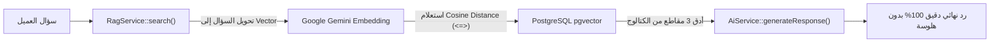

<div dir="rtl">

# 🤖 خريطة ملفات البوت ومحرك الـ RAG والذكاء الاصطناعي (Rudood V2 AI Architecture)

# 1. 🧠 العقل المدبر ومحركات الذكاء الاصطناعي والـ RAG (الباك إند)

</div>

<div dir="ltr">

| Component | Responsibility | Relative File Path |
| :--- | :--- | :--- |
| **`RagService`** | Chunking documents, generating text embeddings, executing `<=>` cosine distance search with `pgvector`. | [`../../backend/app/Services/RagService.php`](../../backend/app/Services/RagService.php) |
| **`AiService`** | Interfacing with Google Gemini API, system prompts, persona enforcement, response generation. | [`../../backend/app/Services/AiService.php`](../../backend/app/Services/AiService.php) |
| **`BotController` (API)** | Temperature, model switching, auto-reply toggle, welcome message, system instructions. | [`../../backend/app/Http/Controllers/Api/BotController.php`](../../backend/app/Http/Controllers/Api/BotController.php) |
| **`KnowledgeBaseController`** | Uploading store docs, FAQ auto-extraction, document ingestion, indexing status. | [`../../backend/app/Http/Controllers/Api/KnowledgeBaseController.php`](../../backend/app/Http/Controllers/Api/KnowledgeBaseController.php) |
| **`ReindexKnowledgeBase` (Artisan)** | CLI command to regenerate vector embeddings across all documents: `php artisan kb:reindex`. | [`../../backend/app/Console/Commands/ReindexKnowledgeBase.php`](../../backend/app/Console/Commands/ReindexKnowledgeBase.php) |

</div>

<div dir="rtl">

---

# 2. 🗄️ نماذج قواعد البيانات (Eloquent Models & pgvector)

* **[`../../backend/app/Models/Bot.php`](../../backend/app/Models/Bot.php):**  
  إعدادات البوت لكل متجر (الاسم، النبرة الصوتية، قنوات التفعيل، والحد الأقصى للتوكنز).
* **[`../../backend/app/Models/KnowledgeBase.php`](../../backend/app/Models/KnowledgeBase.php):**  
  ملفات ومستندات وكتالوجات المتجر المرفوعة وحالتها.
* **[`../../backend/app/Models/KnowledgeChunk.php`](../../backend/app/Models/KnowledgeChunk.php):**  
  المقاطع النصية المقسمة والمخزن بداخلها عمود المتجهات الرقمية `vector(1536)` المخصص للبحث الدلالي.
* **[`../../backend/app/Models/AiDecisionLog.php`](../../backend/app/Models/AiDecisionLog.php):**  
  سجل القرارات والردود التي يتخذها الذكاء الاصطناعي مع نسبة الثقة والمقاطع المسترجعة كمرجع.

---

# 3. 🖥️ واجهات المستخدم للتحكم في البوت والـ RAG (الفرونت إند)

* **لوحة إعدادات البوت والـ Persona:**  
  [`../../frontend/src/pages/settings/BotSettingsPage.tsx`](../../frontend/src/pages/settings/BotSettingsPage.tsx)  
  *(تغيير نبرة الصوت، اختيار النماذج المتاحة لحظياً، وضبط حدود التدخل البشري).*

* **إدارة قاعدة المعرفة والـ Vector Chunks:**  
  [`../../frontend/src/pages/knowledge/KnowledgeBasePage.tsx`](../../frontend/src/pages/knowledge/KnowledgeBasePage.tsx)  
  *(رفع الكتالوجات، استخراج الأسئلة الشائعة، وعرض حالة الفهرسة).*

* **ميدان اختبار البوت (Playground):**  
  [`../../frontend/src/pages/playground/PlaygroundPage.tsx`](../../frontend/src/pages/playground/PlaygroundPage.tsx)  
  *(تجربة التحدث مع البوت واختبار ردوده وفحص المقاطع الدلالية المسترجعة قبل تفعيله للعملاء).*

* **محاكي الردود الحية (Live Chat Simulator):**  
  [`../../frontend/src/pages/chat/LiveChatPage.tsx`](../../frontend/src/pages/chat/LiveChatPage.tsx)  
  *(رؤية البوت وهو يرد على رسائل العملاء لحظياً عبر الويب سوكت).*

---

# 4. 🔄 كيف يعمل نظام الـ Vector RAG باختصار في الكود؟



### دورة حياة معالجة استفسار العميل خطوة بخطوة

1. **الاستلام:** يستلم النظام استفسار العميل عبر قناة التواصل (واتساب، الشات، أو المتجر).
2. **توليد المتجه (Embedding):** تقوم دالة `RagService::getEmbedding()` بتحويل نص السؤال إلى متجه رقمي عالي الأبعاد (1536 بُعد).
3. **البحث الدلالي (Vector Similarity Search):** ينفذ استعلام SQL مباشر في PostgreSQL باستخدام إضافة `pgvector`:

   ```sql
   SELECT content, (embedding <=> '[vector_data]') AS distance 
   FROM knowledge_chunks 
   WHERE company_id = ? 
   ORDER BY distance ASC LIMIT 3;
   ```

4. **تجميع السياق (Context Augmentation):** يتم استخراج أفضل 3 مقاطع دلالية ذات صلة وتمريرها داخل الـ System Prompt لنموذج Gemini.
5. **التوليد (Generation):** يقوم `AiService` بصياغة الإجابة بناءً على السياق المستخرج فقط ونبرة المتجر المحددة في `Bot.php`.

---

# 5. 💡 أسئلة متوقعة من الدكتور حول البوت والـ RAG

### س: لماذا استخدمتم RAG بدلاً من إعادة تدريب النموذج بالكامل (Fine-Tuning)؟
>
> **الإجابة:**  
> لأن الـ Fine-Tuning مكلف جداً مادياً وحسابياً، ويتطلب ساعات لإعادة التدريب مع كل منتج جديد يُضاف للمتجر، كما أنه معرض للهلوسة. بينما تقنية **RAG مع pgvector** فورية؛ بمجرد رفع التاجر لملف PDF يُصبح جاهزاً للبحث خلال ثوانٍ، وتضمن دقة 100% لأن الإجابة مقيدة بمستندات المتجر فقط.

### س: ما هو دور إضافة `pgvector` في PostgreSQL؟
>
> **الإجابة:**  
> تُضيف نوع بيانات جديد اسمه `vector` ومؤشرات بحث سريعة مثل `HNSW` و `IVFFlat`، وتتيح حساب المسافة بين المعاني رياضياً باستخدام خوارزمية **Cosine Distance (`<=>`)** مباشرة داخل قاعدة البيانات دون الحاجة لقاعدة بيانات متجهات خارجية منفصلة مثل Pinecone.

</div>
