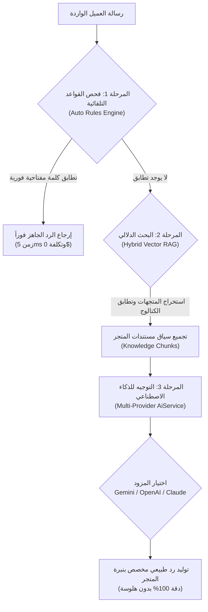
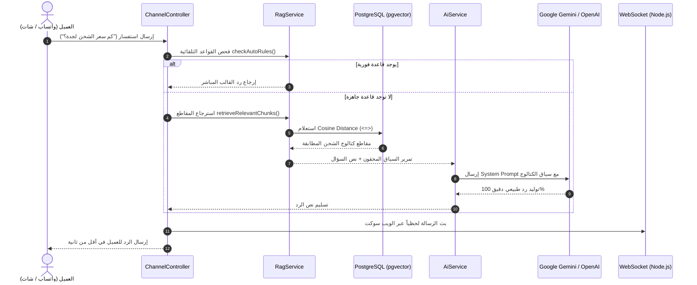

<div dir="rtl">

# 🤖 الشرح الشامل والمفصل لكود البوت، دواله، وهندسة الذكاء الاصطناعي (Rudood V2 Bot Engine)
# Comprehensive Guide to Bot Code, Functions, AI Providers & Vector RAG Architecture

> **إعداد:** الفريق الهندسي لمنصة ردود للذكاء الاصطناعي (Rudood AI Platform V2)  
> **الفئة المستهدفة:** الطلاب، المطورون، ومناقشات لجان التحكيم والدكتور  
> **الحزمة التقنية:** Laravel 11 Services | Google Gemini & OpenAI Multi-Provider | Vector RAG | PostgreSQL  
> **مسار الملف في المشروع:** `DOCS/v2/شرح_كود_البوت_ودوال_الذكاء_الاصطناعي.md`

---

## 📑 فهرس محتويات الدليل

1. [🌟 1. النظرة المعمارية الشاملة: كيف يفكر ويعمل البوت في ردود؟](#1-النظرة-المعمارية-الشاملة-كيف-يفكر-ويعمل-البوت-في-ردود)
2. [🗄️ 2. تشريح نموذج البوت في قاعدة البيانات (`Bot.php`)](#2-تشريح-نموذج-البوت-في-قاعدة-البيانات-botphp)
3. [🧠 3. المحرك المركزي الذكي (`AiService.php`) ودواله سطر بسطر](#3-المحرك-المركزي-الذكي-aiservicephp-ودواله-سطر-بسطر)
4. [🔍 4. محرك البحث الدلالي والاسترجاع (`RagService.php`) ودواله الحسابية](#4-محرك-البحث-الدلالي-والاسترجاع-ragservicephp-ودواله-الحسابية)
5. [🎮 5. متحكم واجهة برمجة التطبيقات (`BotController.php`)](#5-متحكم-واجهة-برمجة-التطبيقات-botcontrollerphp)
6. [🔄 6. مخطط تسلسل الأحداث اللحظية من رسالة العميل حتى خروج الرد](#6-مخطط-تسلسل-الأحداث-اللحظية-من-رسالة-العميل-حتى-خروج-الرد)
7. [🎤 7. أهم 5 أسئلة برمجية يسألها الدكتور عن كود البوت مع الإجابات الدقيقة](#7-أهم-5-أسئلة-برمجية-يسألها-الدكتور-عن-كود-البوت-مع-الإجابات-الدقيقة)

---

# 1. 🌟 النظرة المعمارية الشاملة: كيف يفكر ويعمل البوت في ردود؟

يعمل بوت منصة ردود عبر نظام تصفية ثلاثي المراحل (**3-Tier Hybrid AI Cascade**):



---

# 2. 🗄️ تشريح نموذج البوت في قاعدة البيانات (`Bot.php`)

* **مسار الملف:** [`../../backend/app/Models/Bot.php`](../../backend/app/Models/Bot.php)
* **الوظيفة:** يمثل الكيان الرقمي للبوت المرتبط بالمتجر (`Workspace`). يحتوي على شخصيته، ونبرة صوته، وتشفير مفاتيحه الأمنية.

### أهم الحقول والدوال المشروحة في المودل:

1. **حقول الإعدادات (`$fillable`):**
   * `name`: اسم المساعد الذكي (مثلاً: "مساعد متجر النخبة").
   * `bot_tone`: نبرة الصوت المحددة (`friendly` ودودة، `formal` رسمية، أو `sales` بيعية تحفيزية).
   * `system_prompt`: التوجيهات البرمجية الصارمة التي تحكم سلوك البوت.
   * `ai_provider`: مزود الذكاء الاصطناعي (`gemini`، `openai`، `anthropic`، `openai_compatible`).
   * `model_type`: النموذج المحدد (مثل: `gemini-1.5-flash` أو `gpt-4o-mini`).
   * `temperature`: درجة إبداعية النموذج (من `0.0` إلى `1.0`، وتكون منخفضة للدقة العالية).
   * `enable_rag`: تفعيل أو تعطيل البحث في ملفات الكتالوج.
   * `enable_auto_rules`: تفعيل أو تعطيل الكلمات المفتاحية السريعة.

2. **التشفير الأمني لمفتاح الـ API (`Crypt::encryptString`):**
   لضمان أعلى معايير الأمان، إذا قام التاجر بإدخال مفتاح API خاص به، لا يتم تخزينه كنص مكشوف أبداً، بل يتم تشفيره عبر دوال الـ Mutator / Accessor في لارافيل:
</div>

<div dir="ltr">

```php
// Location: backend/app/Models/Bot.php
public function setApiKeyAttribute(?string $value): void
{
    // Encrypt the API key before writing to PostgreSQL
    $this->attributes['api_key_encrypted'] = !empty($value) 
        ? Crypt::encryptString($value) 
        : null;
}

public function getApiKeyAttribute(): ?string
{
    if (empty($this->api_key_encrypted)) return null;
    // Decrypt transparently when accessed by AiService
    return Crypt::decryptString($this->api_key_encrypted);
}
```

</div>

<div dir="rtl">

---

# 3. 🧠 المحرك المركزي الذكي (`AiService.php`) ودواله سطر بسطر

* **مسار الملف:** [`../../backend/app/Services/AiService.php`](../../backend/app/Services/AiService.php)
* **الوظيفة:** يعتبر الموجه الرئيسي (Multi-Provider Router). يستقبل رسالة العميل وسياق الكتالوج، ويقوم بصياغة الـ Prompt واستدعاء النموذج المناسب مع معالجة الأخطاء وحالات السقوط الاحتياطية (Fallback).

### شرح الدوال الأساسية في `AiService`:

#### 1. دالة توليد الرد الرئيسية: `generateReply()`
* **المدخلات:**
  * `$userMessage`: نص رسالة العميل القادمة.
  * `$context`: سياق المستندات والكتالوج المسترجع من الـ RAG.
  * `$history`: سجل الرسائل السابقة (لتوفير ذاكرة حوار متعددة الجولات Multi-Turn Memory).
  * `$overrides`: متغيرات آنية لاختبار النماذج وتغيير الحرارة أثناء التشغيل التجريبي.
* **آلية العمل:**
  تفحص المزود المختار في إعدادات البوت، ثم توجه الطلب آلياً إلى إحدى الدوال الخاصة (`callGemini` أو `callOpenAI` أو `callAnthropic`). وفي حال حدوث أي خطأ في شبكة الذكاء الاصطناعي، تلتقط الـ Exception فورياً وتستدعي الرد الاحتياطي المهذب (`getFallbackReply`).

#### 2. دالة استدعاء جوجل جيميناي: `callGemini()`
* تتصل بـ Google Gemini API الرسمي (`gemini-1.5-flash` أو `gemini-1.5-pro`).
* ترسل تعليمات النظام المخصصة (`systemInstruction`) متضمنة شخصية المتجر وسياق الـ RAG وقواعد منع الهلوسة.
* تضبط الـ Safety Settings والـ Temperature لضمان سرعة رد فائقة خلال أجزاء من الثانية.

#### 3. دالة استدعاء أوبن إيه آي: `callOpenAI()`
* تتصل بـ OpenAI Chat Completions API (`https://api.openai.com/v1/chat/completions`).
* تنشئ مصفوفة رسائل منسقة (`system`، `assistant`، `user`).
* تدعم نماذج `gpt-4o-mini` فائقة السرعة والاقتصادية.

#### 4. دالة جلب النماذج المتاحة لحظياً: `fetchAvailableModels()`
* دالة ذكية تستعلم مباشرة من خوادم Google أو OpenAI عن قائمة النماذج الفعالة حالياً وتقدمها لشاشة إعدادات البوت في الفرونت إند ليتسنى للمدير الاختيار منها دون الحاجة لكتابة اسم النموذج يدوياً.

</div>

<div dir="ltr">

```php
// Core Routing Logic inside backend/app/Services/AiService.php
public function generateReply(string $userMessage, string $context = '', array $history = [], array $overrides = []): string
{
    $provider = $this->overrides['ai_provider'] ?? $this->bot->ai_provider ?: 'gemini';
    $apiKey   = $this->resolveApiKey($provider);

    $normalizedHistory = $this->normalizeHistory($history);

    try {
        return match ($provider) {
            'openai'            => $this->callOpenAI($userMessage, $context, $apiKey, $normalizedHistory),
            'gemini'            => $this->callGemini($userMessage, $context, $apiKey, $normalizedHistory),
            'anthropic'         => $this->callAnthropic($userMessage, $context, $apiKey, $normalizedHistory),
            'openai_compatible' => $this->callOpenAiCompatible($userMessage, $context, $apiKey, $normalizedHistory),
            default             => $this->callGemini($userMessage, $context, $apiKey, $normalizedHistory),
        };
    } catch (\Exception $e) {
        \Log::error('AI Service Exception: ' . $e->getMessage());
        return $this->getFallbackReply($context, $userMessage);
    }
}
```

</div>

<div dir="rtl">

---

# 4. 🔍 محرك البحث الدلالي والاسترجاع (`RagService.php`) ودواله الحسابية

* **مسار الملف:** [`../../backend/app/Services/RagService.php`](../../backend/app/Services/RagService.php)
* **الوظيفة:** هو المسؤول عن تحويل الاستفسارات إلى متجهات رقمية وحساب درجة التقارب والتشابه بين كلام العميل وكتالوج المتجر.

### تفكيك دوال `RagService`:

#### 1. دالة فحص القواعد التلقائية: `checkAutoRules()`
* تبحث في جدول `auto_rules` عن أي تطابق فوري مع كلمات مفتاحية حددها التاجر مسبقاً (مثل: "رقم الحساب"، "مواعيد العمل"). إذا وُجد تطابق، يُعاد الرد فوراً دون الحاجة لاستهلاك توكنز الذكاء الاصطناعي.

#### 2. دالة حساب التشابه الكوسيني رياضياً: `calculateCosineSimilarity()`
* تحسب زاوية جيب التمام بين متجهين رقميين في الفضاء متعدد الأبعاد:
$$\text{Cosine Similarity} = \frac{\vec{A} \cdot \vec{B}}{\|\vec{A}\| \|\vec{B}\|}$$
* تعيد قيمة بين `0.0` (لا يوجد أي تشابه) و `1.0` (تطابق دلالي تام).

#### 3. دالة الاسترجاع الهجين: `retrieveRelevantChunks()`
* **الابتكار الهندسي (Hybrid Scoring):** لا تعتمد على المتجهات وحدها ولا على الكلمات المفتاحية وحدها، بل تجمع بينهما بمعادلة ترجيح ذكية:
  $$\text{Final Score} = (\text{Vector Score} \times 0.65) + (\text{Keyword BM25 Score} \times 0.35)$$
* ترتب المقاطع المسترجعة تنازلياً وتختار أفضل 3 إلى 5 مقاطع الأكثر دقة، ثم تدمجها في قالب نصي نقي لتزويد الـ `AiService` بها.

</div>

<div dir="ltr">

```php
// Math Engine inside backend/app/Services/RagService.php
public function calculateCosineSimilarity(array $vecA, array $vecB): float
{
    if (empty($vecA) || empty($vecB)) return 0.0;
    
    $len = min(count($vecA), count($vecB));
    $dotProduct = 0.0;
    $normA = 0.0;
    $normB = 0.0;

    for ($i = 0; $i < $len; $i++) {
        $a = (float) $vecA[$i];
        $b = (float) $vecB[$i];
        $dotProduct += ($a * $b);
        $normA += ($a * $a);
        $normB += ($b * $b);
    }

    if ($normA <= 0.0 || $normB <= 0.0) return 0.0;

    return round($dotProduct / (sqrt($normA) * sqrt($normB)), 4);
}
```

</div>

<div dir="rtl">

---

# 5. 🎮 متحكم واجهة برمجة التطبيقات (`BotController.php`)

* **مسار الملف:** [`../../backend/app/Http/Controllers/Api/BotController.php`](../../backend/app/Http/Controllers/Api/BotController.php)
* **الوظيفة:** هو نقطة النهاية (REST API Endpoints) التي تتحدث معها واجهة React في شاشة `BotSettingsPage.tsx`.

### أهم دوال الـ Controller:

1. **`getSettings()`:**  
   تعيد إعدادات البوت الحالية بصيغة JSON آمنة (دون إظهار مفتاح الـ API المشفر، بل تعيد فقط علامة `has_custom_key: true/false`).
2. **`updateSettings(Request $request)`:**  
   تتحقق من صحة المدخلات (`Validation`) مثل النبرة واسم البوت والنموذج، وتقوم بتحديث السجل في قاعدة البيانات.
3. **`toggleActive(Request $request)`:**  
   زر تشغيل/إيقاف رئيسي (Master Switch) لتعطيل الردود الآلية بنقرة زر وتحويل كل المحادثات مباشرة إلى الدعم البشري.
4. **`models(Request $request)`:**  
   واجهة API تجلب للواجهة الأمامية أحدث أسماء الموديلات المدعومة من Google أو OpenAI لاختيارها من القائمة المنسدلة.

---

# 6. 🔄 مخطط تسلسل الأحداث اللحظية من رسالة العميل حتى خروج الرد

يوضح هذا المخطط التسلسلي خط سير البيانات بالتفصيل بين ملفات النظام:



---

# 7. 🎤 أهم 5 أسئلة برمجية يسألها الدكتور عن كود البوت مع الإجابات الدقيقة

### س1: كيف تمنعون تسريب مفاتيح الـ API في قاعدة البيانات في حال تم اختراق السيرفر؟
> **الإجابة:**  
> "باستخدام ميزة الـ Mutator في مودل `Bot.php`؛ فالمفتاح يُشفر فورياً باستخدام خوارزمية التشفير المتماثل `AES-256-CBC` التابعة لـ Laravel Crypt قبل وصوله لحقل `api_key_encrypted`، وحقل التشفير موضوع ضمن قائمة `$hidden` لضمان عدم خروجه أبداً في استجابات الـ JSON."

### س2: ماذا تفعلون إذا كان سؤال العميل يحتوي على أخطاء إملائية أو لهجة عامية؟
> **الإجابة:**  
> "هنا تكمن قوة محرك البحث الدلالي في `RagService.php`؛ فالنظام لا يبحث عن مطابقة حرفية للكلمات، بل يحول الجملة إلى متجهات رياضية تعبر عن 'المعنى' عبر `generateVectorEmbedding`، ويقيس الزاوية الكوسينية. فمثلاً كلمة 'كم التوصيل' وكلمة 'سعر الشحن' لهما نفس المتجه الدلالي تقريباً في فضاء المتجهات."

### س3: كيف يتعامل البوت مع المحادثات الطويلة (Multi-Turn Memory)؟
> **الإجابة:**  
> "دالة `generateReply` في `AiService.php` تستقبل مصفوفة `$history`. نقوم بتنظيم التاريخ في دالة `normalizeHistory` ونمرر آخر رسائل متبادلة داخل طلب الـ API للنموذج، مما يمكنه من فهم الضمائر مثل 'وكم وزنه؟' بالإشارة للمنتج المذكور في الرسالة السابقة."

### س4: لماذا بنيتم `AiService` كمزود متعدد (Multi-Provider) ولم تكتفوا بـ Gemini فقط؟
> **الإجابة:**  
> "تطبيقاً لمبدأ **Vendor Independence**؛ فإذا حدث انقطاع في خوادم Google، أو رغب العميل في استخدام حسابه الخاص في OpenAI، يمكن التبديل بين النماذج بنقرة زر في لوحة التحكم دون إعادة كتابة أي كود برمجي."

### س5: كيف تضمنون عدم استهلاك الموارد إذا تعطل مزود الذكاء الاصطناعي الخارجي؟
> **الإجابة:**  
> "جميع استدعاءات الـ HTTP في `AiService` محكومة بـ `timeout(30)` ومغلفة داخل كتل `try/catch`. فإذا تأخر السيرفر الخارجي أو سقط، تلتقط الدالة الخطأ آلياً وتفعل الـ `getFallbackReply`، وتسجل تفاصيل الخطأ في `AiDecisionLog` لمراجعتها من قبل المشرف دون أن تتوقف المنصة."

---

<div align="center">

### 🏆 ملخص:
**أصبح لديك الآن توثيق كامل وشامل لكل سطر كود، دالة، ونموذج يخص البوت والـ RAG في منصة ردود V2.**

</div>

</div>
