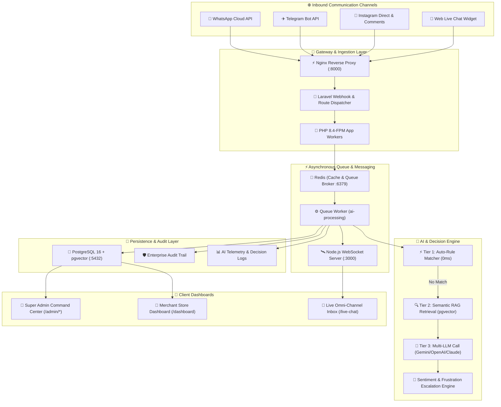
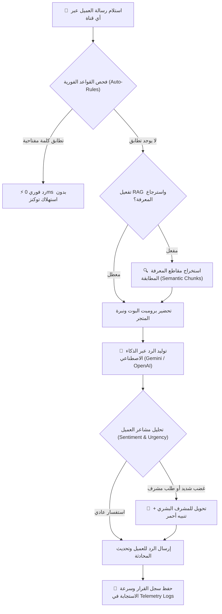

# 🚀 منصة ردود للذكاء الاصطناعي — Rudood AI Omni-Channel Platform

<p align="center">
  
  
  
  
  
  
</p>

---

<div dir="rtl">

## 📖 نظرة عامة على المنصة (Platform Overview)

**منصة ردود (Rudood)** هي منصة ذكية متكاملة لأتمتة خدمة العملاء والمبيعات للمتاجر الإلكترونية والشركات عبر قنوات التواصل المتعددة (**WhatsApp Cloud API**, **Telegram Bot**, **Instagram Direct & Comments**, **Web Live Chat Widget**).

تتيح المنصة لأصحاب المتاجر تقليل تكاليف الدعم الفني بنسبة تتجاوز **70%**، وتقديم ردود فورية فائقة الدقة خلال أقل من **1.2 ثانية**، مع فهم دقيق للغة العربية ومختلف اللهجات، مستندة إلى تقنيات استرجاع المعرفة بالبحث الدلالي (**RAG**) وقواعد الردود اللحظية الذكية.

---

## 🏛️ بنية النظام المعمارية (System Architecture)

يعتمد النظام على معمارية الخدمات الموزعة والمتكاملة (Microservices & Event-Driven Architecture) المبنية على الحاويات:

</div>



---

<div dir="rtl">

## 🔄 مسار معالجة الرسائل الذكي (Multi-Tier AI Decision Flow)

لضمان أعلى سرعة وأقل تكلفة لاستهلاك التوكنز، تتبع المنصة معمارية القرار المتسلسل الثلاثي:

</div>



---

<div dir="rtl">

## 🛠️ تفاصيل الحزمة التقنية (Tech Stack Breakdown)

| الطبقة التقنية | التقنية المستخدمة | الإصدار | دورها وسبب اختيارها |
| :--- | :--- | :--- | :--- |
| **الإطار الأساسي** | **Laravel** | `11.x` | أمان فائق، معمارية قوية للشركات، دعم كامل للـ Multi-Tenancy ونظام الصلاحيات. |
| **بيئة التشغيل** | **PHP** | `8.4 / 8.2+` | دعم أحدث مزايا الأداء والـ JIT والتعامل السريع مع البيانات. |
| **قاعدة البيانات الأساسية** | **PostgreSQL** | `16` | أداء عالي، دعم حقول `JSONB` المعقدة، وموثوقية متناهية. |
| **البحث الدلالي الذكي** | **`pgvector`** | `v0.7+` | تخزين متجهات الذكاء الاصطناعي (Embeddings) وإجراء بحث تشابه دلالي فائق السرعة داخل DB مباشرة. |
| **خادم الكاش والطوابير** | **Redis** | `Alpine` | إدارة طوابير معالجة رسائل الذكاء الاصطناعي (`ai-processing`) والـ Rate Limiting. |
| **الويب سوكت اللحظي** | **Node.js + Socket.IO** | `v20 LTS` | بث الرسائل الفورية وتحديث شاشة المحادثات المباشرة للوكيل البشري دون تحديث الصفحة. |
| **خادم الويب** | **Nginx + PHP-FPM** | `Alpine` | خادم ويب خفيف وسريع مع إدارة العمليات التلقائية عبر **Supervisor**. |
| **واجهة المستخدم** | **Blade + Bootstrap 5.3** | `RTL` | تصميم زجاجي عصري (Glassmorphism & Dark Luxury) مخصص للأجهزة العربية مع خطوط **Cairo** و **Reem Kufi**. |
| **حاويات التشغيل** | **Docker & Compose** | `v2.x` | تشغيل المنصة بجميع خدماتها بضغطة زر واحدة على أي نظام تشغيل (Windows, Linux, macOS). |

---

## ✨ الميزات والأنظمة المدمجة في المنصة

### 1. 💬 مركز القنوات المتعددة (Omni-Channel Hub)
- **WhatsApp Cloud API**: ربط رسمي مع Meta Graph API لإرسال واستقبال الرسائل التفاعلية والقوالب.
- **Telegram Bot API**: يدعم الـ Webhooks والاستماع المحلي (`php artisan telegram:poll`) مع زر فحص الاتصال الحي.
- **Instagram Direct & Comments**: رد آلي فوري على الرسائل الخاصة والتعليقات على المنشورات.
- **Web Live Chat Widget**: ويدجت خفيف (`widget.js`) يمكن تضمينه في أي متجر خارجي (سلة، زد، شوبيفاي) بسطر كود واحد.
- **مفاتيح تفعيل لحظية (Toggle Switches)**: تشغيل وإيقاف أي قناة بضغطة زر دون مسح الإعدادات.

### 2. 🧠 محرك الذكاء الاصطناعي واسترجاع المعرفة (RAG & Auto-Rules)
- **قواعد الردود اللحظية (Auto-Rules)**: مطابقة الكلمات المفتاحية والردود الفورية بصفر ملي ثانية وتكلفة مجانية.
- **نظام استرجاع المعرفة الدلالي (Semantic RAG)**: تقسيم مستندات المتجر (PDF/DOCX) لقطع ذكية وتغذية البوت بها لمنع الهلوسة.
- **استخراج الأسئلة الشائعة تلقائياً (AI FAQ Extraction)**: قراءة كتيبات المنتجات وتوليد أسئلة وإجابات مهيكلة بضغطة زر.
- **محلل مشاعر العميل (Sentiment & Urgency)**: كشف العملاء الغاضبين وتفعيل التحويل التلقائي للمشرفين.

### 3. 🧪 مختبر الذكاء الاصطناعي (AI Playground)
- محاكي واقعي لاختبار إجابات البوت ومقارنة النماذج وسرعة الاستجابة بالملي ثانية (**Latency Tracking**).
- فاحص مقاطع الـ RAG المسترجعة ونسبة دقة كل مقطع.
- حفظ الإعدادات المختبرة مباشرة لتصبح إعدادات البوت الرسمية.

### 4. 🏪 لوحة تحكم المتجر وصندوق المحادثات الحي (Live Chat Inbox)
- تحكم كامل بنبرة البوت (رسمي، ودود، بيعي).
- **التدخل البشري (Human Takeover)**: زر إيقاف البوت لمحادثة معينة والرد يدوياً ثم استئناف الأتمتة.
- **الردود الجاهزة السريعة (Canned Slash Replies)** عبر اختصارات سلاش (مثل `/welcome`, `/shipping`).
- إضافة ملاحظات CRM داخلية ووسوم العملاء (VIP، مهتم، متردد) وتصدير المحادثات CSV.

### 5. 👑 لوحة تحكم الإدارة العليا (Super Admin Command Center)
- لوحة إحصائيات متقدمة وبث حي للعمليات كل 15 ثانية (`/admin/statistics`).
- إدارة الشركات والمتاجر والاشتراكات مع ميزة **تسجيل الدخول كمالك متجر (Impersonation)**.
- نظام إدارة المدونة والمقالات (CMS).
- **سجل تدقيق أمني مشفر (Enterprise Audit Logs)** يوثق كافة العمليات الحساسة.
- **صندوق رسائل واستفسارات تواصل معنا (`/admin/contacts`)** مع تصنيف الحالات والرد المباشر بالإيميل.
- لوحة مراقبة صحة الخوادم وقواعد البيانات وجداول PostgreSQL.

---

## 💻 دليل التثبيت والتشغيل عبر Docker (Setup with Docker)

### 1. المتطلبات:
- تثبيت برنامج **[Docker Desktop](https://www.docker.com/products/docker-desktop/)** مع تفعيل خيار **WSL 2** لمستخدمي ويندوز.

### 2. خطوات التشغيل السريعة:

</div>

```bash
# 1. استنساخ المستودع
git clone https://github.com/abdo544445/rudood-platform.git
cd rudood-platform

# 2. بناء وتشغيل الحاويات في الخلفية
docker compose up -d --build

# 3. تشغيل الهجرات وتحميل البيانات التجريبية
docker compose exec app php artisan migrate --seed
```

<div dir="rtl">

المنصة ستعمل فوراً على: **[http://localhost:8000](http://localhost:8000)**.

---

## 💻 التشغيل المحلي بدون Docker (Local Setup)

إذا كنت ترغب بالتشغيل المباشر عبر PHP و Composer:

</div>

```bash
cd backend
composer install
cp .env.example .env
php artisan key:generate
touch database/database.sqlite
php artisan migrate --seed
php artisan serve
```

---

<div dir="rtl">

## 🔑 بيانات الدخول التجريبية المعتمدة (Default Credentials)

| الحساب | الصلاحية | البريد الإلكتروني | كلمة المرور |
| :--- | :--- | :--- | :--- |
| **مدير النظام الأعلى (Super Admin)** | وصول كامل لكافة الشركات والأنشطة وقاعدة البيانات | `admin@rudood.com` | `password123` |
| **مالك المتجر التجريبي (Store Owner)** | إدارة متجر النخبة والمحادثات والقنوات والبوت | `owner@store.com` | `password123` |

---

## 🌐 جدول روابط الوصول المباشرة

| الصفحة | الرابط المحلي |
| :--- | :--- |
| **الصفحة الرئيسية (Landing Page)** | [http://localhost:8000/index](http://localhost:8000/index) |
| **العرض التجريبي الحي (Live Demo)** | [http://localhost:8000/demo](http://localhost:8000/demo) |
| **صفحة تواصل معنا (Contact Us)** | [http://localhost:8000/contact](http://localhost:8000/contact) |
| **تسجيل الدخول (Login)** | [http://localhost:8000/login](http://localhost:8000/login) |
| **لوحة تحكم المتجر (Store Dashboard)** | [http://localhost:8000/dashboard](http://localhost:8000/dashboard) |
| **صندوق المحادثات المباشر (Live Inbox)** | [http://localhost:8000/live-chat](http://localhost:8000/live-chat) |
| **مركز القنوات (Omni-Channel Hub)** | [http://localhost:8000/channels](http://localhost:8000/channels) |
| **مختبر الذكاء الاصطناعي (AI Playground)** | [http://localhost:8000/playground](http://localhost:8000/playground) |
| **لوحة المدير الأعلى (Super Admin)** | [http://localhost:8000/admin/dashboard](http://localhost:8000/admin/dashboard) |
| **مستكشف قاعدة البيانات والهيكل** | [http://localhost:8000/admin/database](http://localhost:8000/admin/database) |
| **صندوق رسائل تواصل معنا الواردة** | [http://localhost:8000/admin/contacts](http://localhost:8000/admin/contacts) |
| **سجل تدقيق الأمان (Audit Logs)** | [http://localhost:8000/admin/audit-logs](http://localhost:8000/admin/audit-logs) |

---

## 🧪 حزمة الاختبارات الآلية (Automated Test Suite)

تحتوي المنصة على جناح اختبارات متكامل يشمل **102 اختباراً** آلياً بنسبة نجاح **100%**:

</div>

```bash
php tests_suite_runner.php
```

```
=========================================================
🚀 STARTING RUDOOD PLATFORM COMPLETE TEST SUITE
=========================================================
📦 Suite 1: Authentication, Authorization & Roles (6/6 PASS)
📦 Suite 2: Super Admin Command Center (15/15 PASS)
📦 Suite 3: Tenant Store Dashboard & Real-Time Chat (7/7 PASS)
📦 Suite 4: AI Engine, RAG & Knowledge Base Services (8/8 PASS)
📦 Suite 5: AI Playground Workbench (6/6 PASS)
📦 Suite 6: Settings, Channels & Webhooks (11/11 PASS)
📦 Suite 7: Advanced High-Impact AI Capabilities (10/10 PASS)
📦 Suite 8: WhatsApp Interactive Messages (7/7 PASS)
💬 Suite 9: Live Chat & Agent Experience Enhancements (7/7 PASS)
📊 Suite 10: Conversion Analytics & ROI Tracking (7/7 PASS)
🛠️ Suite 11: System Maintenance Mode & Route Protection (7/7 PASS)
🚀 Suite 12: Subscriber Onboarding & Lead Approval Workflow (7/7 PASS)
=========================================================
Total Tests Run : 102 | Passed Tests : 102 | Success Rate : 100%
=========================================================
```

---

<div dir="rtl">

## 📄 التوثيق الإضافي (Documentation)

- 📘 [التوثيق البرمجي والتقني الشامل بالإنجليزية (PROJECT_DOCUMENTATION.md)](./docs/PROJECT_DOCUMENTATION.md)
- 📗 [دليل التثبيت والتشغيل السريع بالعربية (SETUP_GUIDE_AR.md)](./docs/SETUP_GUIDE_AR.md)

---

<p align="center">
  صنع بكل فخر لتمكين التجارة الإلكترونية وخدمة العملاء الذكية 🚀
</p>

</div>
