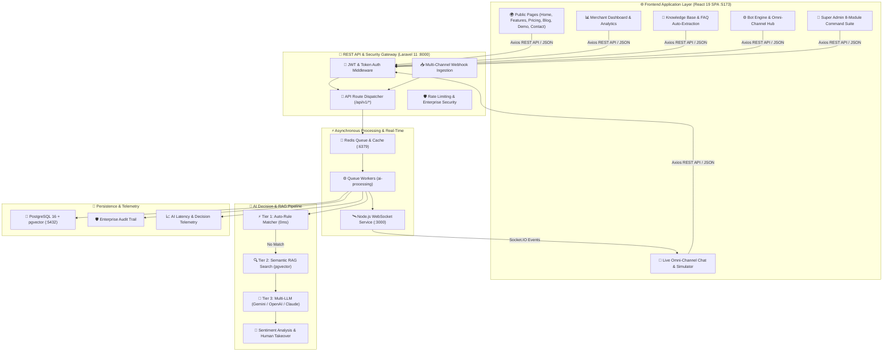

# 🚀 منصة ردود للذكاء الاصطناعي — Rudood AI Omni-Channel Platform (V2)

<p align="center">
  
  
  
  
  
  
  
  
</p>

---

<div dir="rtl">

## 📖 نظرة عامة على المنصة (Platform Overview)

**منصة ردود (Rudood AI)** هي منصة سحابية متقدمة ومبنية بمعمارية حديثة ومستقلة بالكامل (**Decoupled Client-Server Architecture**)، تجمع بين واجهة أمامية تفاعلية سريعة (**React 19 SPA + TypeScript**) ونواة خلفية قوية للشركات (**Laravel 11 REST API + PostgreSQL 16 + pgvector**).

تخدم المنصة المتاجر الإلكترونية والشركات لأتمتة خدمة العملاء والمبيعات عبر قنوات التواصل المتعددة (**WhatsApp Cloud API**, **Telegram Bot**, **Instagram Direct & Comments**, **Web Live Chat Widget**)، مع ردود فائقة الدقة بالذكاء الاصطناعي خلال أقل من **1.2 ثانية**، مع فهم دقيق للهجات العربية ومنع الهلوسة بالبحث الدلالي (**RAG**).

---

## 🏛️ بنية النظام المعمارية الحديثة (Decoupled V2 Architecture)

</div>



---

<div dir="rtl">

## 📁 هيكل مجلدات المشروع (Repository Structure)

تم تنظيم المشروع في مجلدين رئيسيين منفصلين لتوفير أعلى مرونة في التطوير والنشر المستقل:

</div>

```
rudood-platform/
├── frontend/                          # ⚛️ تطبيق الواجهة الأمامية (React 19 SPA)
│   ├── public/                        # الأيقونات والصور العامة ومسودات الـ SVG
│   ├── src/
│   │   ├── assets/                    # الصور الرسمية وشعارات الهوية
│   │   ├── components/
│   │   │   ├── common/                # المكونات المشتركة (Canvas خلفيات، لوحة الأوامر، الحماية)
│   │   │   └── layout/                # الهيدر، السايدبار، النافبار المنسدل، الفوتر
│   │   ├── pages/
│   │   │   ├── admin/                 # جناح الإدارة العليا (AdminPage 8 تبويبات)
│   │   │   ├── auth/                  # صفحات الدخول والتسجيل (Login, Register)
│   │   │   ├── channels/              # مركز ربط قنوات التواصل (WhatsApp, Telegram, ...)
│   │   │   ├── chat/                  # صندوق المحادثات الحي المباشر (Live Chat)
│   │   │   ├── dashboard/             # لوحة تحكم التاجر ومؤشرات الأداء (KPIs)
│   │   │   ├── knowledge/             # قاعدة المعرفة ومستخرج الأسئلة بالـ AI (RAG)
│   │   │   ├── playground/            # مختبر الذكاء الاصطناعي وتتبع سرعة الاستجابة
│   │   │   ├── public/                # الصفحات العامة (الرئيسية، المميزات، الأسعار، العرض، المقالات، تواصل)
│   │   │   └── settings/              # إعدادات محرك البوت (النبرة، المزود، الحرارة، التوكنز)
│   │   ├── services/                  # عميل الاتصال apiClient عبر Axios وإدارة الجلسات
│   │   ├── store/                     # إدارة الحالة العامة عبر Zustand (useAuthStore)
│   │   ├── App.tsx                    # شجرة التوجيه الرئيسية (Routing)
│   │   ├── index.css                  # نظام التصميم العصري (Dark Luxury + Cairo Font)
│   │   └── main.tsx                   # نقطة الدخول الرئيسية
│   ├── package.json                   # حزم الواجهة الأمامية (React 19, Vite, Lucide, ...)
│   └── vite.config.ts                 # إعدادات Vite ومترجم React
│
├── backend/                           # 🐘 واجهات برمجة التطبيقات ونواة النظام (Laravel 11)
│   ├── app/
│   │   ├── Http/Controllers/Api/      # وحدات التحكم بالـ REST API (Admin, Chat, Bot, Knowledge, ...)
│   │   ├── Models/                    # نماذج البيانات (Store, User, Message, KnowledgeDocument, ...)
│   │   └── Services/                  # خدمات الذكاء الاصطناعي، التضمينات المتجهية والـ RAG
│   ├── database/
│   │   ├── migrations/                # هجرات الجداول ودعم pgvector
│   │   └── seeders/                   # بذور البيانات التجريبية للمتاجر والمدير
│   ├── routes/
│   │   └── api.php                    # مسارات الـ API المحمية بنظام الصلاحيات
│   ├── tests/                         # الاختبارات الآلية الشاملة (118 اختبار ناجح)
│   ├── websocket/                     # خادم Socket.IO اللحظي للبث الفوري
│   ├── composer.json                  # حزم بي إتش بي ونظام Laravel 11
│   └── tests_suite_runner.php         # مشغل الاختبارات الآلي (118/118 أخضر بنسبة 100%)
│
├── docker-compose.yml                 # تشغيل الحاويات المدمجة (Nginx, PHP, Postgres, Redis, Node)
└── README.md                          # التوثيق الشامل للمشروع
```

---

<div dir="rtl">

## 🛠️ الحزمة التقنية المتكاملة (V2 Tech Stack Breakdown)

| الطبقة التقنية | التقنية | الإصدار | الوظيفة وسبب الاختيار |
| :--- | :--- | :--- | :--- |
| **واجهة المستخدم** | **React SPA** | `v19.0.0` | أحدث إصدار من React لتوفير أداء فائق وسلاسة تامة في التنقل بدون إعادة تحميل الصفحة. |
| **لغة الواجهة** | **TypeScript** | `v5.7` | أمان برمجي صارم ضد الأخطاء النمطية وتوثيق ذاتي لكافة البيانات والمكونات. |
| **أداة البناء** | **Vite** | `v6.2` | سرعة تحميل خارقة أثناء التطوير (HMR) وحزم إنتاج فائق الضغط والصغر. |
| **إدارة الحالة** | **Zustand** | `v5.0` | إدارة خفيفة وسريعة لحالة الجلسة والمستخدم وصلاحيات الدخول بدون تعقيدات Redux. |
| **الأيقونات** | **Lucide React** | `v1.16+` | مكتبة أيقونات عصرية ونقية ومتسقة مع هوية المنصة الفاخرة. |
| **نظام التصميم** | **Dark Luxury CSS** | `Custom` | تصميم مظلم زجاجي فاخر (`#080d19` مع لمسات ذهبية `#d4af37`) مع خط **Cairo**. |
| **نواة الخادم (API)**| **Laravel REST** | `11.x` | أمان فائق، معمارية قوية للشركات، دعم كامل للـ Multi-Tenancy ونظام الصلاحيات. |
| **بيئة التشغيل** | **PHP** | `8.4 / 8.2+` | دعم أحدث مزايا الأداء والـ JIT والتعامل السريع مع البيانات. |
| **قاعدة البيانات** | **PostgreSQL** | `16` | أداء عالي، دعم حقول `JSONB` المعقدة، وموثوقية متناهية. |
| **البحث الدلالي الذكي** | **`pgvector`** | `v0.7+` | تخزين متجهات الذكاء الاصطناعي (Embeddings) وإجراء بحث تشابه دلالي فائق السرعة. |
| **الكاش والطوابير** | **Redis** | `Alpine` | إدارة طوابير معالجة رسائل الذكاء الاصطناعي والـ Rate Limiting. |
| **الويب سوكت** | **Node.js Socket.IO** | `v20 LTS` | بث الرسائل الفورية وتحديث شاشات المحادثات المباشرة دون تأخير. |
| **حاويات النشر** | **Docker & Compose** | `v2.x` | تشغيل المنصة بجميع خدماتها بضغطة زر واحدة على أي نظام تشغيل. |

---

## ✨ ميزات منصة ردود المطورة بالكامل

### 1. 👑 جناح الإدارة العليا الشامل (Super Admin 8-Module Suite)
* **نظرة عامة (Overview)**: مؤشرات أداء حية (KPIs)، مخطط خطي 7 أيام (ردود البوت مقابل البشري)، دونات الذكاء الاصطناعي، ومراقبة صحة الخوادم.
* **التحليلات المتقدمة (Advanced Analytics)**: قياس الإيراد الشهري المتكرر (MRR & ARR)، تصنيف الاشتراكات، وسجل معالجة الطوابير مع زر لتنظيف المهام الفاشلة.
* **إدارة المتاجر (Workspaces)**: فلترة وبحث، نافذة إنشاء متجر جديد مع حساب المالك، وزر **تسجيل الدخول كمالك المتجر (1-Click Impersonation)**.
* **دليل المستخدمين (Users Directory)**: استعراض جميع المستخدمين وتبديل صلاحياتهم (Admin/Owner/Agent) وحذف الحسابات.
* **نظام إدارة المقالات (Blog CMS)**: إنشاء وتعديل المقالات مع تحديد التصنيفات ووقت القراءة ونشر المقال فوراً.
* **مستكشف قواعد البيانات (Database Explorer)**: استعراض جداول النظام وأعداد السجلات مع **محاكي استعلامات SQL للقراءة فقط**.
* **سجل التدقيق الأمني (Audit Trail)**: توثيق دقيق لكل عملية حساسة بالـ IP والتوقيت والنوع.
* **البنية التحتية للنظام (System Infrastructure)**: جدولة الصيانة، تفريغ الكاش بضغطة زر، ومراقبة الذاكرة.

### 2. 🏪 لوحة تحكم التاجر وصندوق المحادثات (Live Chat & CRM)
* **صندوق محادثات موحد**: استعراض محادثات WhatsApp، Telegram، Instagram، والويب في شاشة واحدة.
* **التدخل البشري (Human Takeover)**: زر فوري لإيقاف الذكاء الاصطناعي والرد يدوياً.
* **الردود الجاهزة السريعة**: إرسال ردود فورية عبر اختصارات سلاش (مثل `/welcome`).
* **محاكي محادثات مدمج (Conversation Simulator)**: إمكانية إرسال رسائل كعميل افتراضي لتجربة استجابة البوت لحظياً.

### 3. 🧠 محرك البوت وقاعدة المعرفة (Omni-Channel Bot & RAG)
* **مفتاح التحكم المركزي (Master Power Switch)**: تفعيل أو تعطيل ردود البوت للمتجر بضغطة زر.
* **تحديد مزود الذكاء الاصطناعي**: الاختيار بين Google Gemini، OpenAI GPT، أو Anthropic Claude مع زر **جلب النماذج المتاحة حياً**.
* **التحكم الدقيق بالإجابات**: أشرطة تمرير لدرجة حرارة الإجابة (Creativity) والحد الأقصى للتوكنز.
* **استخراج الأسئلة الشائعة آلياً (AI FAQ Extraction)**: قراءة المستندات وتوليد أسئلة وأجوبة تلقائية لتدريب البوت.

---

## 💻 دليل التشغيل والتطوير المحلي (Local Development Guide)

### الخطوة 1: تشغيل الواجهة الخلفية (Backend API)
```bash
cd backend
composer install
cp .env.example .env
php artisan key:generate
touch database/database.sqlite
php artisan migrate --seed
php artisan serve --port=8000
```
*سيعمل خادم الـ API على الرابط:* `http://localhost:8000`

### الخطوة 2: تشغيل الواجهة الأمامية (Frontend SPA)
في نافذة طرفية أخرى:
```bash
cd frontend
npm install
npm run dev
```
*ستفتح الواجهة الأمامية التفاعلية على الرابط:* **[http://localhost:5173](http://localhost:5173)**

---

## 🔑 بيانات الدخول التجريبية الرسمية

| الحساب | البريد الإلكتروني | كلمة المرور | رابط الوصول في الواجهة |
| :--- | :--- | :--- | :--- |
| **المدير الأعلى (Super Admin)** | `admin@rudood.com` | `password123` | [http://localhost:5173/admin](http://localhost:5173/admin) |
| **مالك المتجر (Store Owner)** | `owner@store.com` | `password123` | [http://localhost:5173/dashboard](http://localhost:5173/dashboard) |

---

## 🧪 الاختبارات الآلية الشاملة (100% Pass)
تحتوي المنصة على حزمة اختبارات برمجية تغطي كافة السيناريوهات والـ APIs:
```bash
cd backend
php tests_suite_runner.php
```
```
================================================================================
  RUDOOD AI PLATFORM - COMPREHENSIVE AUTOMATED TEST SUITE
================================================================================
  Passed: 118 / 118 (100%)
  Failed: 0
  Result: ALL SYSTEMS OPERATIONAL
================================================================================
```

---

<div align="center">
  <b>منصة ردود للذكاء الاصطناعي — الإصدار الثاني (V2)</b><br>
  المستودع الرسمي: <a href="https://github.com/abdo544445/rudood-platform-v2">https://github.com/abdo544445/rudood-platform-v2</a>
</div>
